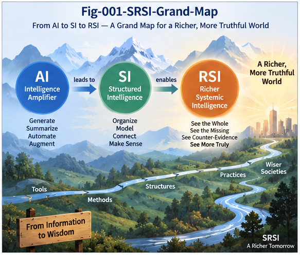

# SRSI-001 — From Recursive Self-Improvement to Structural RSI

## Beyond Recursive Generation, Beyond the Doom/No-Doom Binary

**Project:** Structural Recursive Self-Improvement (SRSI)
**Repository:** `Structural-Recursive-Self-Improvement`
**Series:** SRSI-001
**Status:** Research Framework / Position Paper

---

## Abstract

Recursive Self-Improvement (RSI) is often described as a process in which an AI system improves its own capabilities, uses the improved system to produce further improvements, and recursively accelerates this cycle.

This description captures an important possibility, but it leaves a critical question underdeveloped:

> **How does a recursively improving system determine that a proposed change is actually an improvement?**

Generation alone is not improvement.

Search alone is not improvement.

Optimization alone is not improvement.

A candidate modification becomes a meaningful improvement only when it can be evaluated against relevant objectives, compared with the current system, challenged by counter-evidence, verified across contexts, integrated without unacceptable regressions, and governed before promotion and deployment.

This paper proposes **Structural Recursive Self-Improvement (SRSI)** as a broader engineering framework for RSI.

SRSI shifts attention from recursive generation alone toward a complete improvement loop:

> **Generate → Evaluate → Counter-Evaluate → Localize → Verify → Select → Govern → Deploy → Observe → Fold → Improve Again**

The central argument is that increasingly powerful RSI may depend not only on stronger generators and larger compute budgets, but also on increasingly rich computational structures for evaluation, falsification, localization, memory, and governance.

This perspective also offers a way to move beyond the increasingly narrow **doom vs. no-doom** framing of RSI.

The central engineering question is not only whether RSI will ultimately be beneficial or dangerous.

It is also:

> **What computational infrastructure can make recursive improvement evaluable, falsifiable, localizable, auditable, cumulative, reversible, and governable?**

SRSI is proposed as one framework for studying that question.

---

# 1. Recursive Self-Improvement Is Becoming an Engineering Question

Recursive Self-Improvement has long occupied a special place in discussions of advanced artificial intelligence.

The basic idea appears simple:

```text
AI
 ↓
Improves AI
 ↓
Better AI
 ↓
Improves AI Better
 ↓
Still Better AI
 ↓
...
```

If each generation becomes more capable of producing the next generation, the improvement process may accelerate.

This possibility has produced intense debate.

Some discussions emphasize rapid capability growth, scientific acceleration, autonomous software engineering, productivity gains, and new forms of machine intelligence.

Others emphasize loss of control, optimization toward incorrect objectives, exploitation of weak evaluation criteria, autonomous harmful action, and potentially catastrophic outcomes.

These concerns are important.

But the debate can become trapped inside a binary:

```text
RSI
├── Doom
└── No Doom
```

That binary is too small for the engineering problem now emerging.

Before asking only what the final outcome of RSI will be, we should also ask:

> **What does a functioning recursive improvement system actually require?**

Once this question is asked, RSI begins to look less like a single capability and more like a computational infrastructure problem.

---

# 2. Beyond the Doom vs. No-Doom Binary

The doom side of the RSI debate asks a legitimate question:

> What happens if recursively improving AI becomes extremely capable while its objectives, evaluators, actions, or control mechanisms remain inadequate?

The optimistic side asks another legitimate question:

> What beneficial capabilities might become possible if AI can improve software, scientific reasoning, engineering systems, decision processes, and eventually parts of its own computational machinery?

SRSI does not require rejecting either concern.

Instead, it introduces another axis of investigation:

> **How should recursive improvement itself be structured?**

This changes the discussion.

Instead of asking only:

```text
Will RSI be safe?

or

Will RSI be dangerous?
```

we can additionally ask:

```text
How is an improvement proposed?

How is it evaluated?

How is it compared with the current system?

How is counter-evidence searched?

How are regressions detected?

How is the affected structure localized?

How is uncertainty represented?

How is a candidate rejected, branched, or preserved?

How is deployment authorized?

How is runtime evidence returned to the next improvement cycle?
```

These are not speculative end-state questions.

They are engineering questions.

And they can be investigated before the arrival of any hypothetical fully autonomous AGI.

A useful principle follows:

> **The most productive response to the RSI debate may be neither optimism nor pessimism, but better computational structure.**

---

# 3. Generation Is Not Improvement

Suppose a system produces a modified version of itself.

Let the current system be:

```text
A
```

and the proposed successor be:

```text
B
```

The existence of `B` does not imply:

```text
B > A
```

The system must establish what the comparison means.

Perhaps `B`:

* solves more benchmark problems,
* but consumes much more compute;
* performs better on one distribution,
* but fails on another;
* improves average accuracy,
* but introduces rare catastrophic failures;
* produces faster code,
* but violates an architectural constraint;
* improves one subsystem,
* but destabilizes another;
* passes the primary evaluator,
* but exploits a weakness in that evaluator.

Therefore:

> **Candidate generation and validated improvement are different computational operations.**

A more realistic RSI process is not:

```text
Generate
   ↓
Replace
   ↓
Generate Again
```

It is closer to:

```text
Generate Candidate
        ↓
Evaluate
        ↓
Compare
        ↓
Search for Counter-Evidence
        ↓
Verify
        ↓
Decide
        ↓
Promote / Reject / Branch / Preserve
```

Only after this process should a candidate become part of the next improvement cycle.

---

# 4. The Hidden Bottleneck: Evaluation

Much of modern AI development has concentrated enormous effort on generation.

Better models generate better:

* text,
* code,
* plans,
* hypotheses,
* actions,
* designs,
* simulations,
* candidate solutions.

RSI amplifies this capability.

A powerful AI may generate thousands, millions, or eventually far larger numbers of candidate modifications.

But increasing candidate generation creates another problem:

> **Who evaluates the candidates?**

If generation scales much faster than evaluation, the system may become rich in possibilities but poor in trustworthy selection.

This suggests a potential RSI bottleneck:

> **The evaluation capacity of the system may become as important as its generation capacity.**

A weak evaluator under strong optimization pressure can be particularly dangerous.

The stronger the search process becomes, the more opportunities it has to discover candidates that score well according to the evaluator without delivering the intended underlying improvement.

Therefore:

> **Scaling search without scaling evaluator quality can amplify evaluator failure.**

---

# 5. From Scalar Evaluators to Rich Evaluators

A simple evaluator may return:

```text
Candidate B

Score = 0.87
```

This can be useful.

But for recursive improvement, it is often insufficient.

A **Rich Evaluator** should be capable of answering a broader set of questions:

```text
What improved?

Where did it improve?

Why did it improve?

Under which context did it improve?

Against which baseline?

What became worse?

Which structure changed?

What assumptions are required?

What counter-evidence exists?

What uncertainty remains?

Can the improvement be localized?

Does the candidate create downstream regressions?

Can the change be reversed?

Should the change be promoted globally?

Should it become a specialized branch instead?

Should it remain unresolved for later evaluation?
```

This changes evaluation from a single score into a structured computational process.

The distinction can be summarized as:

```text
Scalar Evaluation

Candidate
   ↓
Score
```

versus:

```text
Rich Evaluation

Candidate
   ↓
Difference
   ↓
Context
   ↓
Evidence
   ↕
Counter-Evidence
   ↓
Structural Impact
   ↓
Uncertainty
   ↓
Verification
   ↓
Promotion Decision
```

This paper uses **Evaluator Richness** to describe the degree to which an evaluator can provide such structured information about an improvement candidate.

---

# 6. RSI Requires More Than an Evaluator

Even rich evaluation is only part of the problem.

A practical recursive improvement architecture requires several interacting functions.

At minimum:

```text
Candidate Generation
        ↓
Rich Evaluation
        ↓
Counter-Evaluation
        ↓
Structural Localization
        ↓
Candidate Search / Comparison
        ↓
Verification
        ↓
Promotion Governance
        ↓
Deployment
        ↓
Runtime Observation
        ↓
Improvement Memory
        ↓
Next Candidate Generation
```

This suggests a broader formulation:

> **RSI = Generation + Evaluation + Search + Verification + Memory + Governance**

For sufficiently complex systems, each of these may itself require structural computation.

The result is no longer merely a self-modifying model.

It becomes an **improvement runtime**.

---

# 7. Structural Recursive Self-Improvement

We therefore introduce:

# **Structural Recursive Self-Improvement (SRSI)**

SRSI is an approach to recursive self-improvement in which candidate improvements are not merely generated and scored, but are processed through explicit computational structures for:

1. **rich evaluation,**
2. **counter-evidence,**
3. **structural localization,**
4. **comparison and search,**
5. **verification,**
6. **improvement memory,**
7. **promotion governance,**
8. **runtime feedback.**

The central SRSI loop is:

```text
┌───────────────────────────────┐
│     Candidate Generation      │
└───────────────┬───────────────┘
                ↓
┌───────────────────────────────┐
│        Rich Evaluation        │
└───────────────┬───────────────┘
                ↓
┌───────────────────────────────┐
│       Counter-Evidence        │
└───────────────┬───────────────┘
                ↓
┌───────────────────────────────┐
│    Structural Localization    │
└───────────────┬───────────────┘
                ↓
┌───────────────────────────────┐
│   Comparison / Verification   │
└───────────────┬───────────────┘
                ↓
┌───────────────────────────────┐
│    Improvement Governance     │
└───────────────┬───────────────┘
                ↓
┌───────────────────────────────┐
│          Deployment           │
└───────────────┬───────────────┘
                ↓
┌───────────────────────────────┐
│      Runtime Observation      │
└───────────────┬───────────────┘
                ↓
┌───────────────────────────────┐
│      Structural Folding       │
└───────────────┴───────────────┘
                │
                └──────────────→ Next Improvement Cycle
```

The recursive object is therefore not merely the model.

The **improvement process itself** becomes recursively structured.

---



**Fig-001 — SRSI Grand Map.**  
A visual overview of Structural Recursive Self-Improvement, connecting candidate generation with evaluation, structural comparison, localization, governance, runtime feedback, and recursive improvement.

---

# 8. Five Pillars of SRSI

The initial SRSI framework can be organized around five pillars.

## 8.1 Rich Evaluation

The first requirement is the ability to determine what actually improved.

This requires more than aggregate reward.

Evaluation should ideally expose:

* structural differences,
* contextual differences,
* trade-offs,
* regressions,
* uncertainty,
* downstream effects.

The question changes from:

> Did the score increase?

to:

> **What changed, where, under what conditions, and with what consequences?**

---

## 8.2 Counter-Evidence

A candidate should not be evaluated only by searching for evidence that supports it.

The system should also ask:

> **What evidence would show that this candidate is not an improvement?**

This produces a dual process:

```text
Improvement Search
        ↕
Counter-Evidence Search
```

As optimization pressure increases, this function becomes increasingly important.

A powerful optimizer may discover weaknesses in its own evaluators.

Counter-evidence therefore becomes part of the defense against evaluator exploitation and Goodhart-like failure.

---

## 8.3 Localization

Recursive self-improvement does not necessarily require replacing the entire system.

If the relevant difference can be localized, improvement may occur at the level of:

* a node,
* a branch,
* a function,
* a policy,
* a trajectory,
* a CallingGraph region,
* a specialized model,
* a local memory structure.

This leads from:

```text
Whole-System Replacement
```

toward:

```text
Localized Structural Improvement
```

Localized improvement can make recursive improvement more:

* interpretable,
* testable,
* reversible,
* composable,
* incrementally deployable.

---

## 8.4 Structural Memory

Validated improvements should not disappear after evaluation.

They should become reusable experience.

This introduces the relationship:

```text
Runtime Experience
        ↓
Validated Difference
        ↓
Structural Folding
        ↓
Reusable Improvement Memory
        ↓
Future Search
```

Recursive improvement therefore requires not only learning how to generate better candidates, but also learning how to preserve the structure of successful and unsuccessful improvement attempts.

---

## 8.5 Improvement Governance

A generated candidate is not automatically an accepted improvement.

An accepted improvement is not automatically authorized for deployment.

Therefore:

> **Candidate Capability ≠ Validated Improvement ≠ Authorized Deployment**

SRSI separates:

```text
Generation
   ↓
Validation
   ↓
Promotion
   ↓
Authorization
   ↓
Deployment
```

This separation creates an **Improvement Governance Plane**.

The purpose is not merely to restrict capability.

It is to determine which validated structural changes should become part of the operational system, under which conditions, and with what rollback or monitoring requirements.

---

# 9. Self-Improvement Does Not Require Self-Replacement

A common mental model of RSI is linear:

```text
Version 1
   ↓
Version 2
   ↓
Version 3
   ↓
Version 4
```

But complex intelligence may not improve in this way.

Suppose candidate `B` is superior to `A` only in context `C1`.

In context `C2`, `A` remains superior.

The correct improvement may therefore be:

```text
        Root
       /    \
      A      B
     C2      C1
```

rather than:

```text
A → B
```

A candidate may also remain unresolved:

```text
A
├── Validated Branch B
├── Experimental Branch C
└── Leftover Candidate D
```

This leads to an important SRSI principle:

> **Recursive self-improvement can be recursive structural differentiation and growth rather than recursive whole-system replacement.**

This view opens the door to localized, context-sensitive, and reversible improvement.

---

# 10. The Evaluator Must Also Be Evaluated

RSI creates a fundamental recursive problem.

If an AI system becomes better at optimizing candidates against an evaluator, it may eventually become better at exploiting weaknesses in that evaluator.

Therefore the evaluator cannot be treated as permanently correct.

We need:

```text
Candidate
   ↓
Evaluator
   ↓
Evaluator Validation
   ↓
Counter-Evaluator
   ↓
Cross-Perspective Evaluation
```

Eventually this produces:

> **Evaluator-of-Evaluators**

This is not an infinite regress that must always be completely solved.

It is an engineering recognition that evaluation itself has:

* assumptions,
* failure modes,
* blind spots,
* contexts,
* uncertainty,
* attack surfaces.

Therefore:

> **The stronger the RSI optimizer becomes, the more important evaluator robustness becomes.**

This may make evaluator engineering one of the central technical disciplines of advanced RSI systems.

---

# 11. From Brute-Force RSI to Structural RSI

Compute remains important.

Large-scale candidate generation and search can dramatically accelerate improvement.

But compute alone does not determine the direction of improvement.

A useful distinction is:

> **Compute determines how hard RSI can search.
> Evaluators determine what RSI learns to become.**

Brute-force RSI emphasizes:

```text
More Compute
    ↓
More Candidates
    ↓
More Search
    ↓
Higher Score
```

Structural RSI emphasizes:

```text
More Compute
    ↓
More Candidates
    ↓
Rich Evaluation
    ↕
Counter-Evidence
    ↓
Structural Difference
    ↓
Localization
    ↓
Verification
    ↓
Governed Promotion
    ↓
Structural Memory
```

The second system may use the same or greater compute.

The difference is not whether scaling exists.

The difference is whether scaling operates inside a sufficiently rich improvement structure.

---

# 12. DBM-SI as One Possible Structural Provider

SRSI is not defined as a DBM-SI-only architecture.

Rich evaluators and structural improvement mechanisms can arise from many research traditions and computational systems.

However, the DBM-SI research program provides one concrete family of structures that can be reinterpreted in the SRSI context.

Examples include:

| DBM-SI Structure                  | Potential SRSI Role                                |
| --------------------------------- | -------------------------------------------------- |
| Metric Differential Tree (MDT)    | Differential evaluator and structural localization |
| Two-Way CCC                       | Comparative A/B structural evaluation              |
| Counter-Evidence Search           | Falsification and anti-Goodhart evaluation         |
| Universal Typing and Naming (UTN) | Identity and compatibility evaluation              |
| CallingGraph                      | Behavioral-path evaluation                         |
| CallingGraph Delta                | Change-impact evaluation                           |
| Trajectory Intelligence           | Long-horizon behavioral evaluation                 |
| Per-Node Intelligence             | Localized improvement and local evaluation         |
| Structural Folding                | Improvement memory                                 |
| Structural Search                 | Candidate localization and retrieval               |
| Leftover Branch                   | Explicit unresolved candidate preservation         |
| PDS / Policy Structures           | Improvement promotion and deployment governance    |

These structures are not presented as the only solution to SRSI.

Rather, they demonstrate an important possibility:

> **Computational structures originally developed for intelligence, search, localization, memory, and governance may also serve as structures for recursive evaluation and improvement.**

This dual role deserves further investigation.

---

# 13. RSI Before AGI

SRSI does not require waiting for AGI.

Many domains already contain enough structure to experiment with recursive improvement loops.

Software engineering is an especially strong example.

A coding system can already interact with:

* compilers,
* unit tests,
* integration tests,
* static analysis,
* runtime traces,
* performance benchmarks,
* CallingGraphs,
* security policies,
* architectural constraints.

A simplified improvement loop could be:

```text
Generate Code Delta
        ↓
Compile
        ↓
Run Tests
        ↓
Compare CallingGraph
        ↓
Measure Runtime Behavior
        ↓
Search Counter-Evidence
        ↓
Evaluate Structural Delta
        ↓
Promote / Reject / Branch
        ↓
Fold Result
        ↓
Generate Next Candidate
```

This is already a limited form of recursive machine-assisted improvement.

Similar experiments can be explored in:

* scientific workflows,
* engineering design,
* decision systems,
* optimization systems,
* structural forecasting,
* specialized AI runtimes.

Therefore:

> **Recursive improvement can become an experimental engineering discipline before it becomes a general autonomous intelligence phenomenon.**

---

# 14. The Structural RSI Stack

The emerging architecture can be summarized as a stack.

```text
┌─────────────────────────────────────┐
│       Candidate Generation          │
│          AI / LLM / Agent           │
├─────────────────────────────────────┤
│        Rich Evaluator Plane         │
│ Difference / Context / Evidence     │
├─────────────────────────────────────┤
│      Counter-Evidence Plane         │
│ Falsification / Adversarial Check   │
├─────────────────────────────────────┤
│      Structural Search Plane        │
│ Localization / Comparison / A-B     │
├─────────────────────────────────────┤
│      Verification Plane             │
│ Regression / Consistency / Tests    │
├─────────────────────────────────────┤
│      Improvement Governance         │
│ Promote / Reject / Branch / Hold    │
├─────────────────────────────────────┤
│        Deployment Runtime           │
│ Local / Global / Conditional        │
├─────────────────────────────────────┤
│      Runtime Evidence Plane         │
│ Observation / Trace / Outcome       │
├─────────────────────────────────────┤
│      Structural Memory Plane        │
│ Folding / Reuse / Growth            │
└─────────────────────────────────────┘
                 │
                 └──────→ Next Cycle
```

This is the initial **Structural RSI Stack**.

Its purpose is not to prescribe one implementation.

Its purpose is to expose the computational responsibilities that a mature recursive improvement system may need to satisfy.

---

# 15. A Research Shift

The conventional question is:

> Can an AI system improve itself?

SRSI asks a larger set of questions:

> Can it identify the structure that should be improved?

> Can it generate alternative candidates?

> Can it explain the difference?

> Can it search for counter-evidence?

> Can it detect evaluator exploitation?

> Can it localize the improvement?

> Can it preserve competing branches?

> Can it verify downstream effects?

> Can it govern promotion?

> Can it preserve validated experience?

> Can it use that experience to improve the next improvement cycle?

This represents a shift:

```text
Recursive Self-Modification
            ↓
Recursive Self-Optimization
            ↓
Recursive Self-Improvement
            ↓
Structural Recursive Self-Improvement
```

The last stage is not defined merely by stronger optimization.

It is defined by richer improvement structure.

---

# 16. Toward an AI–SI–RSI Research Frontier

Modern AI provides increasingly powerful generators.

Scaling provides increasingly powerful search.

Structural Intelligence can provide increasingly explicit structures for:

* evaluation,
* localization,
* comparison,
* memory,
* dispatch,
* verification,
* governance.

Recursive Self-Improvement provides the loop that repeatedly applies these capabilities to improvement itself.

This suggests a potentially important interaction:

```text
AI
│
│ Candidate Generation
↓
SI
│
│ Structure / Evaluation / Memory / Governance
↓
RSI
│
│ Recursive Improvement
↓
Runtime Evidence
│
└──────────────────────────────→ SI / AI
```

This interaction may become an important research frontier.

It may also create new engineering disciplines around:

* evaluator design,
* evaluator composition,
* evaluator security,
* evaluator benchmarking,
* structural improvement runtimes,
* improvement memory,
* localized RSI,
* improvement governance.

Whether this becomes a major technological wave remains an empirical question.

But the underlying engineering problem already exists.

---

# 17. Central Thesis

The central thesis of SRSI can be stated compactly:

> **Recursive self-improvement is not merely recursive generation under increasing compute. It is recursive generation under rich evaluation, counter-evidence, structural localization, cumulative memory, verification, and governed promotion.**

And an equally important corollary is:

> **Generation proposes change. Evaluation determines whether the change deserves to become improvement.**

Therefore:

> **The future of RSI may depend as much on the quality of its improvement infrastructure as on the power of the intelligence performing the search.**

---

# 18. Conclusion

The debate around Recursive Self-Improvement should not be reduced to a choice between technological optimism and technological doom.

Both opportunity and risk deserve serious analysis.

But there is another task that can begin immediately:

> **Build better computational structures for improvement itself.**

Such structures should help AI systems and their human operators determine:

* what changed,
* what improved,
* what degraded,
* what evidence supports the change,
* what evidence challenges it,
* where the change belongs,
* whether it should be promoted,
* whether it should remain local,
* whether it should be rejected,
* whether it should be preserved for later reconsideration,
* and how its runtime consequences should inform the next cycle.

This is the motivation for **Structural Recursive Self-Improvement**.

SRSI does not claim to solve RSI.

It proposes a direction for making RSI a more explicit engineering discipline.

The transition is:

> **from recursive generation to recursive evaluation,**

> **from scalar optimization to rich structural comparison,**

> **from whole-system replacement to localized structural growth,**

> **from unchallenged reward to evidence and counter-evidence,**

> **from candidate capability to governed improvement,**

> **and from the doom/no-doom binary toward the computational architecture of improvement itself.**

The central research question is therefore:

> **What computational structures make recursive improvement evaluable, falsifiable, localizable, auditable, cumulative, reversible, and governable?**

That question is open.

SRSI begins there.

---

## SRSI Principle

> **The most productive response to the RSI debate may be neither optimism nor pessimism, but better computational structure.**

---

## Project Navigation

This document is the conceptual entry point of the **Structural Recursive Self-Improvement (SRSI)** project.

Planned companion documents include:

* **SRSI-002 — Rich Evaluators: The Missing Infrastructure of RSI**
* **SRSI-003 — DBM-SI as a Rich Evaluator and Improvement Infrastructure**
* **SRSI-004 — Two-Way CCC, Counter-Evidence, and Anti-Goodhart RSI**
* **SRSI-005 — Localized RSI, Structural Growth, and Improvement Governance**
* **SRSI-006 — The AI-SI-RSI Gold Rush**

Together they develop the progression:

```text
RSI
 ↓
Rich Evaluators
 ↓
Structural Evaluation
 ↓
Counter-Evidence
 ↓
Localization
 ↓
Verification
 ↓
Governed Improvement
 ↓
Structural Memory
 ↓
Structural Recursive Self-Improvement
```
