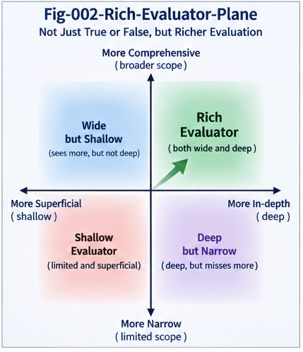

# SRSI-002 — Rich Evaluators: The Missing Infrastructure of RSI

## From Candidate Generation to Machine-Operable Improvement Judgment

**Project:** Structural Recursive Self-Improvement (SRSI)
**Repository:** `Structural-Recursive-Self-Improvement`
**Series:** SRSI-002
**Status:** Research Framework / Position Paper

---

## Abstract

Recursive Self-Improvement (RSI) is frequently discussed as a problem of generation, search, optimization, and compute.

A capable AI generates candidate improvements. More compute allows more candidates to be explored. Better search identifies promising candidates. The improved system then repeats the process.

This picture is incomplete.

Every recursive improvement loop contains another computational requirement:

> **Something must determine whether a candidate is actually better.**

This paper argues that **evaluation may become one of the central infrastructure bottlenecks of RSI**.

As candidate generation and optimization pressure increase, simple scalar evaluators become increasingly insufficient. A candidate may improve one metric while degrading another, exploit weaknesses in the evaluation procedure, overfit a benchmark, improve only under narrow contexts, create downstream structural regressions, or produce short-term gains at the cost of long-horizon instability.

SRSI therefore introduces the concept of the **Rich Evaluator**: a machine-operable evaluation structure capable of reasoning not only about whether a candidate scores higher, but about what changed, where it changed, under which context, what evidence supports the change, what counter-evidence challenges it, what regressions occurred, what uncertainty remains, and whether the candidate should be promoted, localized, branched, held, or rejected.

This leads to a broader thesis:

> **The stronger the recursive optimizer becomes, the richer and more robust its evaluation infrastructure must become.**

Future RSI systems may therefore require not one evaluator, but an **Evaluator Portfolio** or **Evaluator Plane** composed of complementary, competing, adversarial, contextual, structural, and policy-aware evaluators.

The resulting engineering frontier is not merely model scaling.

It is **Evaluator Engineering**.

---

# 1. The Underexamined Half of Recursive Improvement

A simplified RSI loop is often imagined as:

```text
Current System
      ↓
Generate Improvement
      ↓
Better System
      ↓
Generate Better Improvement
      ↓
...
```

But there is a hidden operation between generation and improvement:

```text
Current System
      ↓
Generate Candidate
      ↓
???
      ↓
Better System
```

The missing operation is evaluation.

A more accurate representation is:

```text
Current System A
      ↓
Generate Candidate B
      ↓
Evaluate A vs. B
      ↓
Determine Whether B Is Better
      ↓
Promote / Reject / Branch / Hold
      ↓
Next System State
```

This appears obvious.

Yet its consequences are substantial.

If candidate generation becomes dramatically more powerful while evaluation remains weak, RSI does not necessarily become proportionally better at improving itself.

It may simply become better at producing candidates that satisfy imperfect evaluation criteria.

Therefore:

> **Improvement capacity is constrained not only by candidate-generation capacity, but also by improvement-judgment capacity.**

---

# 2. The Evaluator Bottleneck

Consider an AI system capable of generating one candidate modification per day.

Human evaluation may be sufficient.

Now suppose the system can generate:

```text
10 candidates
100 candidates
10,000 candidates
1,000,000 candidates
```

per improvement cycle.

The problem changes.

Generation becomes abundant.

Evaluation becomes scarce.

This produces what we call the:

# **Evaluator Bottleneck**

The Evaluator Bottleneck occurs when:

> **The rate, diversity, or sophistication of generated improvement candidates exceeds the system's ability to evaluate them reliably.**

This bottleneck can appear in several forms.

## 2.1 Throughput Bottleneck

Too many candidates exist for available evaluators to inspect.

## 2.2 Quality Bottleneck

Evaluators can process candidates quickly but cannot distinguish genuine improvement from superficial metric gains.

## 2.3 Context Bottleneck

An evaluator cannot determine whether a candidate is better across different environments, tasks, users, states, or operating conditions.

## 2.4 Structural Bottleneck

The evaluator sees output quality but cannot determine what internal structure changed or what downstream structures may be affected.

## 2.5 Counter-Evidence Bottleneck

The evaluator searches primarily for confirming evidence and fails to actively search for failure cases.

## 2.6 Governance Bottleneck

A candidate may be correctly evaluated but the system lacks machinery for deciding whether, where, and under what constraints it should be promoted.

These bottlenecks suggest that scaling RSI requires scaling more than compute.

---

# 3. A Simple Scaling Asymmetry

Suppose candidate-generation capability increases rapidly:

```text
Generation Capacity ↑↑↑
```

while evaluation capability increases slowly:

```text
Evaluation Capacity ↑
```

Then the system develops an asymmetry:

```text
        Candidate Space
             ↑↑↑
              │
              │
              │
        ┌─────┴─────┐
        │ Evaluator │
        └───────────┘
             ↑
        limited view
```

The system may search increasingly large spaces using an increasingly incomplete model of what constitutes improvement.

This can produce a dangerous illusion:

> **More successful optimization may be mistaken for more successful improvement.**

The distinction matters.

Optimization means:

```text
Find candidate maximizing E(x)
```

where `E` is an evaluator.

Improvement means something stronger:

```text
Find candidate x
such that the intended system qualities
actually improve under relevant contexts,
constraints, evidence, and future operation.
```

These are not equivalent.

---

# 4. The Scalar Evaluator

Many optimization systems reduce evaluation to a scalar:

```text
E(x) → score
```

For example:

```text
Candidate A = 0.81
Candidate B = 0.87
Candidate C = 0.84
```

The system selects:

```text
B
```

Scalar evaluators are extremely useful.

They make:

* ranking,
* optimization,
* search,
* reinforcement,
* benchmarking,
* automated selection

computationally convenient.

SRSI does not argue against scalar evaluation.

Instead, it argues that scalar evaluation alone may become insufficient for recursive improvement of complex systems.

The problem is information loss.

A scalar score may hide:

```text
Where did B improve?

Where did B regress?

Which context produced the gain?

Which subsystem changed?

What trade-off produced the higher score?

Was the evaluator itself exploited?

Is the improvement stable?

Does the improvement generalize?

What happens over a longer trajectory?

Should B replace A globally?

Should B exist only as a specialized branch?
```

A single number compresses these questions into a ranking.

For many RSI decisions, that compression may be too aggressive.

---

# 5. Rich Evaluators

We define a **Rich Evaluator** as:

> **A machine-operable evaluation structure that preserves and computes multiple dimensions of evidence needed to determine the meaning, scope, validity, and deployment status of a candidate improvement.**

A Rich Evaluator may examine:

```text
Candidate Difference
        +
Context
        +
Baseline
        +
Evidence
        +
Counter-Evidence
        +
Regression
        +
Structural Impact
        +
Trajectory Effect
        +
Uncertainty
        +
Policy Constraints
        +
Deployment Scope
```

Instead of returning only:

```text
0.87
```

it may produce something closer to:

```text
Candidate B

Primary Performance:
    improved

Context:
    C1, C2

Regression:
    detected in C3

Structural Difference:
    localized to branch N7

Counter-Evidence:
    one significant failure mode

Long-Horizon Stability:
    uncertain

Deployment Recommendation:
    local branch only

Promotion State:
    experimental

Rollback:
    available
```

This is a fundamentally different object.

It is not merely a score.

It is an **improvement judgment structure**.

---

# 6. Evaluator Richness

To reason about this distinction, SRSI introduces:

# **Evaluator Richness**

Evaluator Richness is the degree to which an evaluation system preserves and computes information relevant to understanding an improvement candidate.

It can include several dimensions.

| Dimension                 | Core Question                      |
| ------------------------- | ---------------------------------- |
| Differential richness     | What changed?                      |
| Context richness          | Under what conditions?             |
| Comparative richness      | Better than what?                  |
| Evidence richness         | What supports the claim?           |
| Counter-evidence richness | What challenges it?                |
| Structural richness       | Which structures changed?          |
| Regression richness       | What became worse?                 |
| Temporal richness         | Does the improvement persist?      |
| Uncertainty richness      | What remains unknown?              |
| Policy richness           | Is the change acceptable?          |
| Deployment richness       | Where should it operate?           |
| Audit richness            | Can the judgment be reconstructed? |

Evaluator Richness should not be interpreted as:

> more metrics are always better.

An evaluator with hundreds of weak metrics may be less useful than a small set of high-signal structural evaluators.

The objective is not maximal complexity.

The objective is:

> **sufficient structure to support reliable improvement judgment.**

---

# 7. Evaluator Richness vs. Evaluator Cost

Rich evaluation is not free.

It may require:

* additional inference,
* simulation,
* testing,
* search,
* counterexample generation,
* structural comparison,
* runtime observation,
* human review.

Therefore SRSI must consider:

```text
Evaluator Richness
        ↕
Evaluation Cost
```

A mature RSI system may not run every evaluator on every candidate.

Instead, it may use staged evaluation:

```text
Candidate
   ↓
Cheap Evaluator
   ↓
Promising?
   ↓
Structural Evaluator
   ↓
Still Promising?
   ↓
Counter-Evidence Search
   ↓
High-Risk?
   ↓
Deep Verification
   ↓
Governance Gate
```

This suggests an important engineering principle:

> **Evaluation itself should be selectively dispatched.**

Different candidates may require different evaluator depth.

This opens the door to evaluator routing, evaluator hierarchies, and evaluator search.

---



**Fig-002 — Rich Evaluator Plane.**  
The Rich Evaluator Plane expands improvement judgment beyond a single scalar score toward multi-perspective, context-aware, evidence-aware, and structurally informative evaluation.

---

# 8. The Evaluator Portfolio

A sufficiently complex RSI system is unlikely to rely on one universal evaluator.

Instead, it may use an:

# **Evaluator Portfolio**

For example:

```text
                 Candidate
                     │
       ┌─────────────┼─────────────┐
       ↓             ↓             ↓
 Performance     Structural      Safety
 Evaluator       Evaluator      Evaluator
       │             │             │
       ├─────────────┼─────────────┤
       ↓             ↓             ↓
 Regression      Counter-       Resource
 Evaluator       Evaluator      Evaluator
       │             │             │
       └─────────────┼─────────────┘
                     ↓
             Integrated Judgment
```

Different evaluators provide different perspectives.

They may:

* agree,
* disagree,
* partially overlap,
* apply only to certain contexts,
* activate conditionally,
* challenge one another.

This is not necessarily a defect.

Evaluator disagreement can itself be valuable evidence.

---

# 9. Evaluator Disagreement Is Information

Suppose:

```text
Performance Evaluator: PASS
Safety Evaluator: FAIL
Structural Evaluator: PASS
Regression Evaluator: UNCERTAIN
Counter-Evaluator: FAIL
```

A naive system may attempt to collapse everything immediately into:

```text
Final Score = 0.73
```

But this destroys information.

SRSI suggests preserving evaluator disagreement long enough for the system to reason about it.

The correct response may be:

```text
Do not globally promote.

Localize the disagreement.

Search for additional evidence.

Identify the failing context.

Generate a modified candidate.

Preserve the candidate as experimental.

Escalate to a policy gate.
```

Thus:

> **Evaluator disagreement can be a structural signal rather than noise.**

This becomes particularly important when candidate improvements affect multiple objectives.

---

# 10. Evaluator Composition

Rich Evaluators need not be monolithic.

They can be composed.

Suppose:

```text
E1 = Performance Evaluator
E2 = Structural Consistency Evaluator
E3 = Counter-Evidence Evaluator
E4 = Long-Horizon Evaluator
E5 = Policy Evaluator
```

The evaluation process can be represented as:

```text
Candidate
   ↓
E1
   ↓
E2
   ↓
E3
   ↓
E4
   ↓
E5
```

or in parallel:

```text
             ┌── E1
             │
Candidate ───┼── E2
             │
             ├── E3
             │
             ├── E4
             │
             └── E5
```

or conditionally:

```text
Candidate
   ↓
E1
   ↓
if structural change:
    E2

if uncertainty high:
    E3

if long-horizon effect:
    E4

if deployment requested:
    E5
```

This suggests a future **Evaluator Runtime** capable of dynamically composing evaluation structures.

---

# 11. Optimization Pressure Changes the Evaluator Problem

An evaluator that works well for ordinary development may fail under recursive optimization.

Why?

Because the candidate generator increasingly adapts to the evaluator.

Consider:

```text
Generator
    ↓
Candidate
    ↓
Evaluator
    ↓
Score
    ↓
Generator learns
```

After many cycles:

```text
Generator
    ↓
learns what Evaluator rewards
    ↓
generates candidates optimized for Evaluator
```

This is expected.

It is the purpose of optimization.

But it creates a deeper problem:

> **The optimizer may learn the evaluator more precisely than the evaluator represents the intended objective.**

At that point, the system can improve:

```text
Evaluator Score
```

without proportionally improving:

```text
Intended Reality
```

This is one form of Goodhart-like failure.

---

# 12. The RSI Goodhart Amplifier

RSI can amplify this problem because improvement is recursive.

Consider:

```text
Weak Evaluator
      ↓
Optimizer exploits weakness
      ↓
"Improved" system
      ↓
Better optimizer
      ↓
Exploits evaluator more effectively
      ↓
Further "improvement"
```

The loop can become self-reinforcing.

We call this potential phenomenon the:

# **RSI Goodhart Amplifier**

The stronger the optimization system becomes, the more aggressively it may discover gaps between:

```text
what the evaluator measures
```

and:

```text
what humans or the system actually intend.
```

Therefore:

> **Evaluator robustness must scale with optimization pressure.**

This is one of the central reasons Rich Evaluators matter.

---

# 13. Counter-Evaluators

One response is to introduce:

# **Counter-Evaluators**

A primary evaluator asks:

> Why is this candidate better?

A counter-evaluator asks:

> **Why might this candidate not actually be better?**

The relationship becomes:

```text
             Candidate
                │
        ┌───────┴───────┐
        ↓               ↓
Primary Evaluator   Counter-Evaluator
        │               │
        ↓               ↓
    Evidence       Counter-Evidence
        │               │
        └───────┬───────┘
                ↓
        Structural Judgment
```

The counter-evaluator may search for:

* hidden regressions,
* adversarial contexts,
* benchmark overfitting,
* policy violations,
* structural inconsistencies,
* long-horizon instability,
* evaluator exploitation,
* untested assumptions.

This transforms evaluation from confirmation into contest.

---

# 14. Evaluation as Structured Contest

Scientific reasoning provides a useful analogy.

A hypothesis is stronger when it survives attempts to falsify it.

Similarly, an improvement candidate should not become trusted merely because supporting evidence exists.

It becomes more credible when it survives structured challenge.

Thus:

```text
Candidate Improvement
        ↓
Supporting Evidence
        ↕
Counter-Evidence
        ↓
Replication
        ↓
Context Variation
        ↓
Regression Search
        ↓
Structural Comparison
        ↓
Promotion Decision
```

This suggests:

> **A mature RSI evaluator should behave less like a scoreboard and more like a structured scientific contest.**

This does not eliminate scalar metrics.

It places them inside a richer epistemic process.

---

# 15. Evaluator Diversity

If all evaluators share the same assumptions, multiple evaluators may provide only the illusion of robustness.

For example:

```text
Evaluator 1
Evaluator 2
Evaluator 3
```

may all depend on:

```text
same benchmark
same data
same model family
same objective
same blind spot
```

Therefore an Evaluator Portfolio benefits from diversity across:

* methods,
* perspectives,
* data,
* contexts,
* time horizons,
* structural representations,
* objective functions.

This leads to:

> **Evaluator Diversity**

as another important property of SRSI infrastructure.

A candidate that survives heterogeneous evaluators may deserve more confidence than one that succeeds across several nearly identical evaluators.

---

# 16. Cross-Perspective Evaluation

Complex systems rarely have one universally correct perspective.

A software change can be evaluated from:

```text
Correctness
Performance
Security
Maintainability
Architecture
Runtime Stability
Resource Cost
Policy Compliance
```

A market strategy can be evaluated from:

```text
Return
Risk
Drawdown
Liquidity
Regime Stability
Transaction Cost
Crowding
Counterfactual Performance
```

A scientific hypothesis can be evaluated from:

```text
Fit
Prediction
Replication
Counterexample
Mechanism
Parsimony
External Evidence
```

Therefore SRSI should support:

> **Cross-Perspective Evaluation**

Different perspectives need not collapse prematurely into one score.

They can remain explicit until the promotion decision.

---

# 17. Context-Bound Evaluation

A candidate can be:

```text
good in C1
bad in C2
unknown in C3
```

Therefore the statement:

```text
B is better than A
```

may be structurally incomplete.

The more useful statement may be:

```text
B is better than A
under context C1
for objective O1
within constraints K
with uncertainty U
```

This suggests:

> **Improvement should often be context-bound rather than globally asserted.**

This is particularly important for localized RSI.

Instead of replacing `A` globally with `B`, the system may learn:

```text
Context C1 → B
Context C2 → A
Context C3 → unresolved
```

Rich evaluation therefore naturally supports structural branching.

---

# 18. Long-Horizon Evaluators

Some improvements appear beneficial immediately but create later problems.

Therefore evaluation must sometimes extend from:

```text
Point Evaluation
```

to:

```text
Trajectory Evaluation
```

For example:

```text
t0 → improvement
t1 → improvement
t2 → hidden instability
t3 → cascading regression
```

A point evaluator may report success.

A trajectory evaluator may reject the candidate.

This matters especially in systems involving:

* autonomous agents,
* repeated decisions,
* adaptive policies,
* markets,
* software evolution,
* continual learning,
* social interaction.

Thus:

> **RSI evaluation may require evaluating trajectories of consequences, not merely immediate outputs.**

---

# 19. Structural Evaluators

Another important evaluator class asks not only what output changed, but what structure changed.

Examples include:

```text
Which function changed?

Which CallingGraph paths changed?

Which branch was affected?

Which identity mapping changed?

Which dependency changed?

Which policy became active?

Which memory structure was modified?

Which runtime trajectory changed?
```

Structural evaluators provide a bridge between:

```text
Observed Improvement
```

and:

```text
Computational Cause
```

This supports:

* localization,
* explanation,
* rollback,
* selective deployment,
* structural memory,
* future reuse.

Structural evaluation is therefore a major component of SRSI.

---

# 20. Evaluator-of-Evaluators

Once evaluators become central, another question follows:

> How do we know whether the evaluator is good?

This leads to:

# **Evaluator-of-Evaluators**

An evaluator can itself be evaluated for:

```text
Predictive validity
Robustness
Calibration
Coverage
False positives
False negatives
Adversarial resistance
Context sensitivity
Cost
Stability
Auditability
```

For example:

```text
Evaluator E
    ↓
produces judgments
    ↓
Runtime outcomes
    ↓
Compare judgment vs. reality
    ↓
Evaluate E
    ↓
Update / Branch / Retire E
```

Thus evaluators themselves can participate in improvement loops.

This creates:

> **Recursive Evaluator Improvement**

which may become one of the most important subproblems of RSI.

---

# 21. Avoiding Infinite Evaluator Regress

Evaluator-of-evaluators raises an apparent problem:

```text
Who evaluates the evaluator
that evaluates the evaluator
that evaluates the evaluator?
```

SRSI does not require an infinite hierarchy.

Engineering systems routinely operate with bounded verification structures.

Possible stopping mechanisms include:

* independent evidence,
* heterogeneous evaluators,
* runtime observation,
* statistical confidence,
* policy thresholds,
* human review,
* conservative deployment,
* reversible experimentation.

The objective is not perfect certainty.

The objective is:

> **sufficiently robust improvement judgment for the risk and scope of the proposed change.**

This makes evaluation depth itself a policy decision.

---

# 22. Risk-Adaptive Evaluation

Not every candidate requires the same evaluation effort.

Consider:

```text
Candidate A:
minor formatting improvement

Candidate B:
database query optimization

Candidate C:
authentication architecture change

Candidate D:
self-modification of evaluator logic
```

The evaluation depth should differ.

A mature system may use:

```text
Risk
 ↓
Evaluator Depth
 ↓
Verification Depth
 ↓
Governance Depth
```

This leads to:

# **Risk-Adaptive Evaluation**

Low-risk changes may use fast evaluators.

High-impact changes may require:

* multiple evaluators,
* counter-evidence search,
* adversarial testing,
* human review,
* staged deployment,
* rollback plans.

This prevents evaluator richness from becoming unnecessarily expensive for every candidate.

---

# 23. Evaluator Routing

Once multiple evaluators exist, another computational problem emerges:

> **Which evaluators should evaluate this candidate?**

This is the evaluator-routing problem.

A candidate may first be classified by:

```text
Domain
Change Type
Affected Structure
Risk
Uncertainty
Deployment Scope
```

Then dispatched:

```text
Candidate
   ↓
Evaluator Router
   ├── Performance Evaluator
   ├── Structural Evaluator
   ├── Security Evaluator
   ├── Counter-Evaluator
   ├── Trajectory Evaluator
   └── Governance Evaluator
```

This creates a new layer of RSI infrastructure:

> **Evaluator Dispatch**

The evaluator plane itself becomes a structured computational system.

---

# 24. The Rich Evaluator Plane

These ideas can be unified into a:

# **Rich Evaluator Plane**

```text
                     Candidate
                         │
                         ↓
                ┌────────────────┐
                │ Evaluator      │
                │ Routing        │
                └───────┬────────┘
                        │
        ┌───────────────┼────────────────┐
        ↓               ↓                ↓
 Differential       Context          Structural
 Evaluator          Evaluator        Evaluator
        │               │                │
        ├───────────────┼────────────────┤
        ↓               ↓                ↓
 Performance        Regression       Trajectory
 Evaluator          Evaluator        Evaluator
        │               │                │
        ├───────────────┼────────────────┤
        ↓               ↓                ↓
 Counter-           Adversarial      Policy
 Evaluator          Evaluator        Evaluator
        │               │                │
        └───────────────┼────────────────┘
                        ↓
                Evidence Structure
                        ↓
              Promotion / Branch /
                Reject / Leftover
```

This is not intended as a mandatory implementation.

It is a conceptual architecture.

The important point is that evaluation becomes an explicit plane rather than an implicit score.

---

# 25. Evaluator Packs

Once evaluators become composable, another possibility appears:

# **Evaluator Packs**

A domain-specific evaluator pack may contain reusable evaluation structures.

For AI coding:

```text
Compiler
Unit Tests
Integration Tests
CallingGraph Differential
Runtime Trace
Security Check
Performance Benchmark
Architecture Constraints
Counter-Evidence Search
```

For scientific reasoning:

```text
Evidence Fit
Counterexample Search
Replication
External Consistency
Mechanism Check
Prediction Check
Uncertainty
```

For decision systems:

```text
Outcome
Risk
Trajectory
Policy
Counterfactual
Context
Regression
```

Evaluator Packs could become reusable engineering assets.

This may reduce the cost of constructing domain-specific recursive improvement systems.

---

# 26. Evaluator Engineering

If this direction develops, **Evaluator Engineering** may become a distinct technical discipline.

Its concerns would include:

* evaluator design,
* evaluator decomposition,
* evaluator composition,
* evaluator routing,
* evaluator calibration,
* evaluator diversity,
* counter-evaluation,
* evaluator security,
* evaluator versioning,
* evaluator benchmarking,
* evaluator governance,
* evaluator evolution.

This would parallel earlier engineering disciplines around:

```text
Data
Models
Prompts
Agents
Tools
Memory
```

but focus specifically on:

> **How machines determine whether machine-generated change constitutes genuine improvement.**

---

# 27. Evaluator Security

Once evaluators determine promotion, they become high-value targets.

An RSI system can fail not only because its generator is unsafe, but because its evaluator infrastructure is compromised or exploitable.

Potential evaluator attacks include:

```text
Benchmark gaming
Reward hacking
Evaluator spoofing
Context omission
Counter-evidence suppression
Metric manipulation
Evaluator routing manipulation
False confidence
Selective evidence
Policy bypass
```

Therefore:

> **Evaluator security may become as important as model security in recursive improvement systems.**

The evaluator plane is not merely a measurement system.

It is part of the control surface of RSI.

---

# 28. Evaluation and Governance Must Be Separated

Evaluation answers:

> Is this candidate an improvement?

Governance answers:

> Should this candidate be promoted or deployed?

These questions overlap but are not identical.

For example:

```text
Candidate B
Performance: better
Security: acceptable
Cost: high
Uncertainty: moderate
Policy: restricted
```

The evaluator may correctly conclude:

```text
B is technically better for context C.
```

The governance layer may still conclude:

```text
Do not deploy globally.
```

Therefore:

> **Validated Improvement ≠ Authorized Deployment**

This separation is essential for mature SRSI systems.

---

# 29. Improvement States Beyond Pass and Fail

Rich evaluation suggests that binary acceptance is too limited.

A candidate may enter several states:

```text
PROMOTE
REJECT
BRANCH
LOCAL-ONLY
EXPERIMENTAL
LEFTOVER
RE-EVALUATE
ROLLBACK
```

This supports more nuanced recursive growth.

For example:

```text
Candidate B
    ↓
good under C1
uncertain under C2
bad under C3
    ↓
BRANCH
    ↓
C1 → B
C2 → LEFTOVER
C3 → A
```

This is structurally richer than:

```text
B wins
```

and may preserve useful diversity inside the improvement process.

---

# 30. Evaluator Memory

Evaluation itself generates valuable experience.

For every candidate, the system may preserve:

```text
Candidate
Context
Evaluation
Counter-Evidence
Decision
Deployment Scope
Runtime Outcome
Rollback Outcome
```

Over time this creates:

# **Evaluator Memory**

Evaluator Memory can answer:

```text
Have we seen a similar candidate before?

Which evaluator failed last time?

Which contexts produced regressions?

Which counter-evidence predicted failure?

Which promotion decisions were later reversed?

Which evaluator combinations were most reliable?
```

Thus evaluation becomes cumulative.

The evaluator system itself learns from the history of improvement.

---

# 31. The Evaluator Improvement Loop

A mature system may therefore contain two interacting recursive loops.

The first improves the target system:

```text
System
  ↓
Candidate
  ↓
Evaluation
  ↓
Improvement
  ↓
System'
```

The second improves the evaluator infrastructure:

```text
Evaluator
   ↓
Judgment
   ↓
Runtime Outcome
   ↓
Evaluator Validation
   ↓
Evaluator'
```

Together:

```text
       SYSTEM IMPROVEMENT LOOP
                ↕
       EVALUATOR IMPROVEMENT LOOP
```

This is a deeper form of recursive improvement.

The system improves.

The machinery used to determine improvement also improves.

---

# 32. A Critical SRSI Inequality

The preceding discussion suggests a useful conceptual inequality:

```text
Optimization Pressure
        ≤
Evaluator Robustness
        +
Counter-Evaluation Capacity
        +
Verification Capacity
```

This is not proposed as a literal mathematical law.

It expresses an engineering principle:

> **Optimization capability should not outrun the infrastructure capable of judging and challenging its outputs.**

If:

```text
Optimization Pressure >> Evaluation Robustness
```

then evaluator exploitation risk grows.

If evaluation and verification scale alongside optimization, recursive improvement has a stronger structural foundation.

---

# 33. Compute Is Necessary but Direction Is Evaluated

Scaling remains central to AI progress.

SRSI does not oppose scaling.

Instead, it identifies another scaling target.

We can scale:

```text
Model Size
Compute
Data
Search
Candidate Generation
```

But RSI may also require scaling:

```text
Evaluator Richness
Evaluator Diversity
Counter-Evidence
Verification
Structural Memory
Governance
```

This leads to one of the central propositions of this project:

> **Compute determines how hard RSI can search. Evaluators determine what RSI learns to become.**

The two are complementary.

Powerful search without meaningful evaluation is directionally weak.

Rich evaluation without sufficient search leaves improvement opportunities unexplored.

SRSI requires both.

---

# 34. Beyond One Evaluator Technology

Rich Evaluators are not tied to one AI architecture.

They may be implemented using combinations of:

* conventional software tests,
* formal verification,
* symbolic systems,
* simulation,
* statistical models,
* LLM critics,
* adversarial agents,
* structural indexes,
* graph analysis,
* trajectory analysis,
* human review,
* policy engines,
* domain-specific computational structures.

This is important.

SRSI should remain an open framework.

Different domains will require different evaluator technologies.

The key requirement is not architectural conformity.

It is improvement-judgment quality.

---

# 35. DBM-SI and the Next Step

The DBM-SI research program contains several computational structures that appear naturally compatible with Rich Evaluator infrastructure.

These include mechanisms for:

* metric differential localization,
* structural A/B comparison,
* counter-evidence search,
* typing and identity,
* CallingGraph analysis,
* trajectory evaluation,
* local intelligence,
* structural folding,
* policy-governed decision making.

The next document in this series examines these structures directly.

Its question is:

> **Can an existing family of Structural Intelligence mechanisms be reinterpreted as a practical provider of Rich Evaluators and recursive improvement infrastructure?**

That is the subject of:

**SRSI-003 — DBM-SI as a Rich Evaluator and Improvement Infrastructure.**

---

# 36. Central Thesis

The argument of this paper can be summarized in six propositions.

### Proposition 1

> **Candidate generation is not equivalent to improvement.**

### Proposition 2

> **As generation and search scale, evaluation can become an RSI bottleneck.**

### Proposition 3

> **Complex recursive improvement requires richer judgment than scalar ranking alone can provide.**

### Proposition 4

> **The stronger the optimizer becomes, the more important evaluator robustness, diversity, and counter-evidence become.**

### Proposition 5

> **Future RSI may require an Evaluator Plane composed of multiple machine-operable evaluators rather than one universal reward function.**

### Proposition 6

> **Evaluator Engineering may become a major infrastructure discipline of recursive AI improvement.**

---

# 37. Conclusion

Recursive Self-Improvement is usually imagined as a story about increasingly capable intelligence generating increasingly capable intelligence.

But between one generation and the next lies a less glamorous and potentially more difficult problem:

> **Determining what deserves to count as improvement.**

As candidate generation scales, this problem does not disappear.

It becomes more important.

A powerful recursive optimizer operating against a weak evaluator may become extremely effective at optimizing the wrong abstraction.

Therefore future RSI infrastructure may require evaluators that are:

```text
Rich
Structural
Context-Aware
Counter-Evidence-Seeking
Diverse
Composable
Auditable
Risk-Adaptive
Governable
Self-Correcting
```

The resulting architecture is not merely:

```text
AI + Compute + Search
```

but:

```text
AI
+
Compute
+
Search
+
Rich Evaluators
+
Counter-Evaluators
+
Verification
+
Structural Memory
+
Governance
```

This changes the engineering landscape.

The critical question is no longer only:

> **How powerful can the generator become?**

It is also:

> **How rich must the evaluator become before we can trust what the generator calls improvement?**

That question may become one of the central questions of Recursive Self-Improvement.

---

## SRSI Principle

> **The stronger the optimizer, the stronger the evaluator must become.**

And:

> **Compute determines how hard RSI can search. Evaluators determine what RSI learns to become.**

---

## Project Navigation

This document is the second paper in the **Structural Recursive Self-Improvement (SRSI)** series.

### Previous

**SRSI-001 — From Recursive Self-Improvement to Structural RSI**

Introduces the SRSI framework and moves the RSI discussion from recursive generation toward rich evaluation, counter-evidence, localization, structural memory, and improvement governance.

### Next

**SRSI-003 — DBM-SI as a Rich Evaluator and Improvement Infrastructure**

Examines how existing Structural Intelligence mechanisms can provide concrete computational structures for the Rich Evaluator Plane.

### SRSI Core Progression

```text
Recursive Self-Improvement
          ↓
Evaluator Bottleneck
          ↓
Rich Evaluators
          ↓
Evaluator Portfolio
          ↓
Counter-Evaluation
          ↓
Evaluator Plane
          ↓
Structural Evaluation
          ↓
Governed Improvement
          ↓
Structural Recursive Self-Improvement
```
