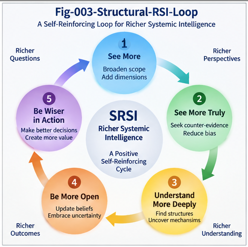

# SRSI-005 — Localized RSI, Structural Growth, and Improvement Governance

## From Whole-System Replacement to Per-Node Improvement, Structural Branching, and Governed Promotion

**Project:** Structural Recursive Self-Improvement (SRSI)
**Repository:** `Structural-Recursive-Self-Improvement`
**Series:** SRSI-005
**Status:** Research Framework / Runtime Architecture Paper

---

## Abstract

Recursive Self-Improvement (RSI) is often imagined as a sequence of whole-system upgrades:

```text
System A
  ↓
System B
  ↓
System C
  ↓
System D
```

This linear replacement model is simple, but it is poorly matched to complex intelligent systems.

Large AI systems contain heterogeneous functions, branches, policies, memories, execution paths, contexts, and local competencies. A candidate improvement may benefit only one node, one context, one trajectory, one CallingGraph region, or one policy regime. Global replacement can therefore create unnecessary risk, obscure causality, increase evaluation cost, and destroy useful structural diversity.

This paper develops **Localized Recursive Self-Improvement (Localized RSI)** as a core mechanism of Structural Recursive Self-Improvement (SRSI).

The central idea is:

> **Recursive self-improvement does not need to mean recursive whole-system replacement. It can mean recursive local structural growth.**

Localized RSI decomposes improvement into:

> **Locate → Generate Local Candidate → Compare → Counter-Evaluate → Verify Locally → Verify Integration → Govern Promotion → Deploy Selectively → Observe → Fold**

This architecture naturally supports:

* Per-Node Intelligence,
* structural branching,
* context-bound promotion,
* explicit Leftover states,
* reversible deployment,
* structural memory,
* improvement governance.

The paper also introduces the **Improvement Governance Plane**, which separates candidate generation, technical validation, promotion, authorization, deployment, and rollback.

The deeper argument is that advanced RSI may become more manageable when improvement is treated as **controlled structural differentiation and growth** rather than repeated monolithic self-replacement.

---

# 1. The Problem with Whole-System RSI

A common mental model of RSI is:

```text
A
↓
B
↓
C
↓
D
```

Each new system replaces the previous one.

This model has several advantages:

* easy versioning,
* simple comparison,
* straightforward promotion logic.

But it also creates major problems.

Suppose Candidate B improves only one subsystem.

Global replacement forces the system to evaluate:

```text
all of B
against
all of A
```

even if the actual useful difference is local.

This increases:

* search cost,
* evaluation cost,
* regression risk,
* rollback complexity,
* causal ambiguity.

The first SRSI alternative is therefore:

> **Localize the improvement before scaling the replacement.**

---

# 2. Improvement Should Follow the Difference

Suppose a large system contains:

```text
System A
├── Node N1
├── Node N2
├── Node N3
├── Node N4
└── Node N5
```

Runtime evidence shows that:

```text
N3
```

is responsible for a recurring failure.

A whole-system RSI process might generate:

```text
System B
```

as a complete replacement.

A localized RSI process instead asks:

```text
Where is the failure?

Which structure owns the failure?

Can improvement be restricted to that structure?
```

Then:

```text
N3
 ↓
Generate N3'
 ↓
Evaluate N3 vs. N3'
 ↓
Integrate if validated
```

This gives a basic principle:

> **The scope of improvement should, where possible, follow the scope of the validated difference.**

---

# 3. Localized Recursive Self-Improvement

We define:

# **Localized Recursive Self-Improvement**

as:

> **A recursive improvement process in which candidate generation, evaluation, promotion, deployment, and memory can operate on localized structural units rather than requiring whole-system replacement.**

The unit may be:

* a node,
* a branch,
* a function,
* a policy,
* a CallingGraph region,
* a trajectory segment,
* an evaluator,
* a memory unit,
* a specialized model,
* a local dispatch rule.

The generic loop is:

```text
Runtime Evidence
      ↓
Localization
      ↓
Target Structure
      ↓
Generate Local Candidate
      ↓
Local Evaluation
      ↓
Counter-Evidence
      ↓
Integration Verification
      ↓
Governed Promotion
      ↓
Selective Deployment
      ↓
Runtime Observation
      ↓
Structural Folding
      ↓
Next Local Improvement
```

---

# 4. Per-Node Intelligence as an RSI Substrate

Per-Node Intelligence becomes especially important in this architecture.

Instead of one intelligence acting uniformly over the entire system:

```text
Global Intelligence
```

the system can contain:

```text
Node A → Local Intelligence A

Node B → Local Intelligence B

Node C → Local Intelligence C
```

Each node can have:

* local state,
* local evaluator,
* local search,
* local memory,
* local policy,
* local improvement history.

This creates the possibility of:

> **Per-Node RSI**

A node can recursively improve without requiring the entire system to reconstitute itself.

---

# 5. Per-Node RSI

A simplified Per-Node RSI loop is:

```text
Node N
  ↓
Observe Runtime Performance
  ↓
Detect Weakness
  ↓
Generate Candidate N'
  ↓
Compare N vs. N'
  ↓
Counter-Evidence
  ↓
Local Verification
  ↓
Integration Check
  ↓
Promote / Branch / Hold
  ↓
Fold Result
```

This is much closer to how large engineered systems evolve in practice.

Software systems are rarely rewritten globally after every improvement.

They evolve through:

* patches,
* modules,
* feature branches,
* localized refactoring,
* staged deployment.

SRSI can adopt the same structural discipline.

---

# 6. Local Search Reduces the Improvement Space

Suppose the full system has search space:

```text
S
```

A whole-system optimizer searches:

```text
Search(S)
```

If structural localization identifies a region:

```text
R ⊂ S
```

then improvement search becomes:

```text
Search(R)
```

This can dramatically reduce the candidate space.

The general pattern is:

```text
Observe
  ↓
Localize
  ↓
Search Locally
  ↓
Evaluate Locally
  ↓
Verify Globally
```

This may offer one of the most practical scaling paths for RSI.

---

# 7. Local Evaluation Does Not Remove Global Verification

Localization should not be confused with isolation.

A local change may have global effects.

Therefore:

```text
Local Improvement
```

must be followed by:

```text
Integration Verification
```

The correct sequence is:

```text
Local Candidate
      ↓
Local Evaluation
      ↓
Local Counter-Evidence
      ↓
Dependency Check
      ↓
Integration Test
      ↓
Global Impact Check
```

This distinction matters.

Localized RSI reduces the evaluation surface.

It does not eliminate system-level verification.

---

# 8. CallingGraph Delta as Local Impact Structure

Software provides a strong example.

Suppose:

```text
Function F
```

is modified to:

```text
Function F'
```

CallingGraph Delta can identify:

```text
Changed Callers

Changed Callees

New Paths

Removed Paths

Affected Runtime Regions
```

This helps estimate:

> **the structural blast radius of the local improvement.**

Then verification can target:

```text
Affected Region
```

instead of:

```text
Entire System
```

This is a direct engineering benefit of localized RSI.

---

# 9. Localization Makes Causality Clearer

If an entire system changes, then later improvement is hard to attribute.

Suppose:

```text
A → B
```

changes 500 internal components.

Performance improves.

Which change caused the improvement?

Which change introduced a hidden regression?

Causality becomes opaque.

Localized RSI narrows the intervention:

```text
N3 → N3'
```

This makes the question easier:

```text
Did N3' cause the observed improvement?
```

Thus:

> **Localization improves causal attribution.**

That matters for future folding and reuse.

---

# 10. Structural Growth Instead of Structural Replacement

Localized RSI naturally leads to a different model of self-improvement.

Instead of:

```text
A
↓
B
↓
C
```

the system may grow:

```text
          Root
        /  |  \
      A1  A2  A3
          |
        A2.1
```

This is:

# **Structural Growth**

The system accumulates:

* branches,
* specialized nodes,
* policies,
* local evaluators,
* contextual variants.

Improvement becomes additive and differentiating, not purely substitutive.

---

# 11. Recursive Structural Differentiation

Suppose:

```text
A
```

works well in Context C1.

Candidate:

```text
B
```

works well in Context C2.

The correct result may be:

```text
        Root
       /    \
      A      B
     C1      C2
```

Later:

```text
B
```

may itself differentiate:

```text
        B
      /   \
    B1    B2
```

This is:

> **Recursive Structural Differentiation**

An intelligent system can improve by becoming more structurally specific.

---

# 12. Branching Preserves Useful Diversity

Winner-take-all optimization removes alternatives.

Structural branching preserves them.

Suppose:

```text
A:
safe but slow

B:
fast but aggressive
```

A naive optimizer may choose one globally.

SRSI may preserve:

```text
Safe Context       → A

Performance Context → B
```

This creates:

> **Functional diversity inside the improved system.**

That diversity can later become valuable under new contexts.

---

# 13. Branches Can Be Temporary

Not every branch must become permanent.

A branch may be:

```text
Stable

Experimental

Conditional

Probationary

Deprecated
```

This supports:

> **Lifecycle-Aware Structural Growth**

A candidate can be deployed experimentally without becoming permanent architecture.

---

# 14. Leftover as a First-Class Improvement State

Some candidates should not be promoted or rejected.

They should remain:

# **Leftover**

For example:

```text
Candidate C

Evidence:
positive

Counter-Evidence:
meaningful

Integration Impact:
uncertain
```

The correct state may be:

```text
LEFTOVER
```

This means:

> preserve the candidate and its evidence without forcing a decision.

Later:

```text
New Evidence
   ↓
Re-evaluate C
```

This gives SRSI:

> **explicit uncertainty preservation.**

---

# 15. Leftover Prevents Premature Structural Commitment

Without Leftover:

```text
Candidate
   ↓
PASS / FAIL
```

With Leftover:

```text
Candidate
   ↓
PROMOTE
REJECT
BRANCH
LOCAL
EXPERIMENTAL
LEFTOVER
```

This prevents the improvement system from converting uncertainty into false certainty.

That is especially important under strong optimization pressure.

---

# 16. Local Promotion

Suppose B improves only:

```text
Context C1
```

Then promotion can be:

```text
Global Promotion:
NO
```

but:

```text
Local Promotion:
YES
```

The dispatch system can learn:

```text
C1 → B

other contexts → A
```

This creates:

# **Context-Bound Promotion**

Context-bound promotion is one of the strongest arguments for structural RSI.

---

# 17. Promotion Is Not Replacement

A subtle but important distinction:

```text
Promotion
```

does not always mean:

```text
Replace old structure.
```

Promotion may mean:

```text
Activate as branch

Enable only in context

Expose to limited traffic

Enable under policy

Use as fallback

Use as experimental specialist
```

Therefore:

> **Promotion is an operational status transition, not necessarily a structural deletion of the predecessor.**

---

# 18. Improvement Governance

Once improvement states multiply, governance becomes essential.

We define:

# **Improvement Governance**

as:

> **The computational and policy process that determines whether, where, when, and under what constraints a validated improvement candidate may become operational.**

Evaluation answers:

```text
Is B better?
```

Governance asks:

```text
Should B be activated?

Where?

For whom?

Under which conditions?

At what scale?

With what monitoring?

With what rollback?
```

These are different questions.

---

# 19. The Improvement Governance Plane

A mature SRSI system therefore needs an:

# **Improvement Governance Plane**

```text
Candidate
   ↓
Technical Evaluation
   ↓
Counter-Evidence
   ↓
Verification
   ↓
Improvement Governance
   ↓
Promotion State
```

Possible promotion states include:

```text
PROMOTE-GLOBAL

PROMOTE-LOCAL

BRANCH

EXPERIMENTAL

SHADOW

HOLD

LEFTOVER

REJECT

ROLLBACK
```

This is richer than binary deployment.

---

# 20. Candidate Capability Is Not Validated Improvement

A strong candidate may demonstrate:

```text
Capability Gain
```

but that does not automatically imply:

```text
Validated Improvement
```

For example:

```text
Capability:
higher

Risk:
higher

Compatibility:
lower

Policy:
violated
```

Thus:

> **Candidate Capability ≠ Validated Improvement**

This is a foundational SRSI separation.

---

# 21. Validated Improvement Is Not Authorized Promotion

Even after validation:

```text
Validated Improvement
```

the system may decide:

```text
Do not promote globally.
```

For example:

* insufficient observation,
* policy restriction,
* high blast radius,
* low rollback confidence,
* environment mismatch.

Therefore:

> **Validated Improvement ≠ Authorized Promotion**

---

# 22. Authorized Promotion Is Not Authorized Action

A promoted capability may still face runtime action governance.

Thus:

```text
Candidate Capability
        ≠
Validated Improvement
        ≠
Authorized Promotion
        ≠
Authorized Action
```

This creates layered control.

It separates:

```text
What the system can do

What improved

What may become part of the system

What the system may actually execute
```

This layered separation is important for advanced AI governance.

---

# 23. PDS as Improvement Governance Runtime

Policy Decision Systems provide a natural implementation pattern.

An improvement candidate can be represented by:

```text
Candidate

Context

Evidence

Counter-Evidence

Risk

Uncertainty

Deployment Scope
```

Then PDS evaluates:

```text
Policy
```

to produce:

```text
PROMOTE

LOCAL-ONLY

EXPERIMENTAL

HOLD

REJECT
```

Thus PDS becomes:

> **a Promotion Control Plane for SRSI.**

---

# 24. Risk-Adaptive Promotion

Not all improvements require the same governance.

Consider:

```text
Change A:
documentation formatting

Change B:
query optimization

Change C:
authentication logic

Change D:
self-modification of evaluator code
```

The promotion process should scale with risk.

A possible model is:

```text
Impact ↑
Risk ↑
Uncertainty ↑
      ↓
Evaluation Depth ↑
Governance Depth ↑
Deployment Caution ↑
```

This is:

# **Risk-Adaptive Promotion**

---

# 25. Staged Deployment

One way to reduce risk is staged deployment.

For example:

```text
Candidate
  ↓
Shadow Mode
  ↓
1% Traffic
  ↓
5% Traffic
  ↓
Local Branch
  ↓
Global Promotion
```

At each stage:

```text
Runtime Evidence
```

can challenge earlier evaluation.

This turns deployment itself into part of evaluation.

---

# 26. Runtime Is an Evaluator

Pre-deployment evaluation is never complete.

Therefore runtime observation becomes:

> **the final and ongoing evaluator.**

The loop is:

```text
Promote
  ↓
Deploy
  ↓
Observe
  ↓
Compare Expected vs. Actual
  ↓
Continue / Restrict / Rollback
```

This is especially important for candidates affecting complex environments.

---

# 27. Rollback Is Part of Improvement, Not Failure

Traditional thinking treats rollback as failure.

SRSI should treat it as a normal control mechanism.

A mature improvement runtime should preserve:

```text
Previous Structure

Candidate Structure

Promotion State

Runtime Evidence

Rollback Path
```

Then:

```text
Unexpected Regression
        ↓
Rollback
        ↓
Fold Failure Evidence
        ↓
Improve Evaluator
```

Rollback itself becomes learning.

---

# 28. Reversibility as a Design Requirement

For high-impact candidates:

```text
Can we reverse this?
```

should be asked before deployment.

This suggests:

# **Reversibility-Aware Improvement**

Candidates may be ranked not only by:

```text
Performance
```

but also:

```text
Rollback Cost

State Compatibility

Migration Cost

Recovery Time
```

A slightly weaker but easily reversible candidate may sometimes be preferable to a stronger irreversible one.

---

# 29. Versioned Structural Growth

Localized SRSI naturally supports versioning.

For example:

```text
Node N
├── N-v1
├── N-v2
└── N-v3
```

Different versions may remain available.

Dispatch can choose:

```text
Context C1 → N-v3

Context C2 → N-v2
```

This is more flexible than one global version number for the entire intelligence system.

---

# 30. Structural Memory of Improvement

Every promotion cycle generates valuable structure:

```text
Candidate

Affected Node

Evidence

Counter-Evidence

Decision

Deployment Scope

Runtime Result

Rollback Result
```

This should be folded into:

# **Improvement Memory**

Later:

```text
New Problem
   ↓
Structural Search
   ↓
Retrieve Similar Improvement
   ↓
Reuse Evaluator / Candidate / Policy
```

Thus localized RSI becomes cumulative.

---

# 31. Improvement Memory Reduces Relearning

Without memory:

```text
Problem X
   ↓
search from scratch
```

With Structural Folding:

```text
Problem X
   ↓
retrieve similar case
   ↓
reuse prior branch
   ↓
adapt locally
```

This can dramatically reduce recursive search cost.

---

# 32. Failed Improvements Are Valuable Memory

Improvement Memory should preserve not only successes.

It should also preserve:

```text
Rejected Candidate

Counter-Evidence

Rollback Event

Evaluator Failure

Context Mismatch
```

This creates:

> **Negative Improvement Memory**

Later systems can avoid repeating the same mistake.

---

# 33. Per-Node Structural Memory

Each node can accumulate local experience:

```text
Node N

History:
- Candidate N1
- Candidate N2
- Counterexample C7
- Policy Restriction P4
- Runtime Failure F2
```

This creates:

> **Per-Node Improvement Memory**

The node becomes increasingly specialized.

---

# 34. Localized RSI as a Continual Learning Mechanism

Localized RSI overlaps naturally with Structural Continual Learning.

A system can grow:

```text
existing branch
      ↓
difference detected
      ↓
new branch
      ↓
local validation
      ↓
integration
      ↓
memory
```

This turns continual learning into:

> **Continual Structural Improvement**

rather than opaque global weight drift alone.

---

# 35. 3-Cat Learning and New Improvement Categories

Suppose a candidate is neither clearly A-like nor B-like.

The system may create:

```text
Category C
```

This is useful when the environment changes.

Instead of forcing every improvement into known categories:

```text
A / B
```

the system can grow:

```text
A / B / C
```

This supports open-ended structural evolution.

---

# 36. Localized RSI and Non-Stationary Environments

Many real systems operate in changing environments.

A globally optimized solution may become stale.

Localized branching allows:

```text
Old Context → Old Branch

New Context → New Branch
```

The system can evolve without deleting useful prior structures.

This is especially important for:

* markets,
* software platforms,
* scientific models,
* user populations,
* policy regimes.

---

# 37. Localized RSI and Multi-Objective Systems

Whole-system optimization often struggles with conflicting objectives.

For example:

```text
Speed

Safety

Cost

Accuracy
```

A structural approach can preserve specialized branches:

```text
Fast Branch

Safe Branch

Low-Cost Branch

High-Accuracy Branch
```

Then policy and context determine dispatch.

This avoids forcing all objectives into one global optimum.

---

# 38. Localized RSI Reduces Goodhart Pressure

Localization also helps with evaluator robustness.

A global evaluator must model:

```text
entire system
```

A local evaluator may need to model:

```text
one node + dependencies
```

This can make evaluation:

* narrower,
* more explicit,
* more testable,
* harder to game.

Therefore:

> **Localization can reduce Goodhart pressure by narrowing the domain over which the evaluator must remain valid.**

---

# 39. Local Optimization Can Still Cause Global Failure

However, localized RSI introduces another danger.

Suppose every node improves according to its local evaluator:

```text
N1 improves

N2 improves

N3 improves
```

yet the whole system becomes worse.

This is:

# **Local Improvement / Global Regression**

Therefore every local promotion should include:

```text
Integration Verification
```

and, when necessary:

```text
System-Level Evaluation
```

Localized RSI is not permission for uncoordinated hill climbing.

---

# 40. Global Coherence Evaluators

A mature system may therefore require:

```text
Local Evaluators
        +
Global Coherence Evaluators
```

Local evaluators ask:

```text
Did this node improve?
```

Global evaluators ask:

```text
Does the system remain coherent?
```

This creates:

```text
Local Improvement
      ↓
Global Coherence Check
      ↓
Promotion
```

---

# 41. Structural Contracts

Another way to protect global coherence is through:

# **Structural Contracts**

A node may be allowed to improve only while preserving:

```text
Input Type

Output Type

Latency Bound

Policy Bound

Dependency Contract

Identity
```

This makes local change safer.

UTN can contribute identity and compatibility structures here.

---

# 42. Improvement Budgeting

Localized RSI also enables:

# **Improvement Budgets**

A node may receive bounded resources:

```text
Compute Budget

Search Budget

Evaluation Budget

Deployment Budget

Risk Budget
```

This prevents uncontrolled recursive search everywhere at once.

It also supports prioritization.

---

# 43. Where Should RSI Spend Its Compute?

Once improvement is localized, the system can ask:

```text
Which node deserves improvement effort?
```

Priority may be based on:

```text
Failure frequency

Expected gain

Risk

Cost

Uncertainty

Strategic importance
```

This becomes:

> **Improvement Resource Allocation**

RSI therefore becomes not only self-improvement, but self-directed improvement budgeting.

---

# 44. Improvement Queues

A practical runtime may maintain:

```text
Improvement Queue
```

containing:

```text
Node N3 — high failure

Node N7 — high cost

Policy P2 — high uncertainty

Evaluator E5 — calibration drift
```

Candidates can be prioritized structurally.

This turns RSI into an operating system-like process.

---

# 45. Improvement as a Runtime Service

At this point, RSI can be viewed as a service:

```text
Observe
   ↓
Diagnose
   ↓
Localize
   ↓
Generate
   ↓
Evaluate
   ↓
Govern
   ↓
Deploy
   ↓
Observe Again
```

This is:

# **Improvement Runtime**

rather than an occasional training event.

---

# 46. Localized RSI for Evaluators Themselves

The same architecture applies to evaluators.

Suppose:

```text
Evaluator E
```

performs poorly in one context.

Instead of replacing the entire evaluator plane:

```text
E → E'
```

the system can:

```text
Context C
   ↓
Local Evaluator Branch E_C
```

Thus evaluator infrastructure also evolves locally.

---

# 47. Governance of Evaluator Improvement

Evaluator changes may be especially sensitive.

Because evaluators decide what counts as improvement, modifying them changes the optimization target.

Therefore evaluator self-modification should often require deeper governance:

```text
Evaluator Candidate
      ↓
Independent Evaluation
      ↓
Counter-Evaluation
      ↓
Shadow Deployment
      ↓
Policy Approval
```

This creates a hierarchy of improvement sensitivity.

---

# 48. Improvement Sensitivity Levels

A useful conceptual ladder is:

```text
Level 0:
Presentation / cosmetic change

Level 1:
Local performance optimization

Level 2:
Behavioral logic change

Level 3:
Policy change

Level 4:
Evaluator change

Level 5:
Improvement-runtime change
```

Higher levels should require stronger verification and governance.

---

# 49. Self-Modification of the Improvement Runtime

The deepest form of RSI occurs when the system modifies:

```text
the machinery that decides how improvement happens.
```

This includes:

```text
Evaluator Routing

Promotion Policy

Search Strategy

Structural Memory

Counter-Evidence Logic
```

Such changes should not be treated like ordinary local optimization.

They affect the rules of future improvement.

Thus:

> **Meta-improvement requires meta-governance.**

---

# 50. The Improvement Constitution

At advanced stages, a system may need stable rules governing improvement itself.

This can be thought of as an:

# **Improvement Constitution**

It may specify:

```text
What may self-modify

What requires external approval

Which evaluators must remain independent

Which changes require rollback capability

Which structures may never be modified autonomously

Which evidence is mandatory
```

This is a natural extension of the Improvement Governance Plane.

---

# 51. Structural Growth and Human Oversight

Localized RSI can also improve human oversight.

Instead of asking humans to review:

```text
an entirely new system
```

they may review:

```text
one change

one branch

one evaluator conflict

one policy decision
```

Structural localization makes oversight more tractable.

---

# 52. Auditability of Local Improvement

A local promotion can leave a precise record:

```text
Target:
Node N3

Baseline:
N3-v4

Candidate:
N3-v5

Evidence:
E1, E2

Counter-Evidence:
CE1

Decision:
LOCAL PROMOTION

Policy:
P7

Runtime Result:
PASS

Rollback:
available
```

This creates:

> **Improvement Provenance**

A mature SRSI system should preserve such provenance.

---

# 53. Improvement Provenance

Improvement Provenance answers:

```text
Who or what generated the candidate?

Which structure changed?

Which evaluators participated?

Which evidence mattered?

Who authorized promotion?

Where was it deployed?

What happened afterward?
```

This is essential for:

* audit,
* debugging,
* governance,
* science,
* accountability.

---

# 54. Structural Growth Can Be Pruned

Growth alone can create complexity.

Therefore SRSI also needs:

# **Structural Pruning**

Branches that become:

```text
obsolete

unused

dominated

unsafe

redundant
```

may be retired.

Thus the lifecycle is:

```text
Generate
  ↓
Branch
  ↓
Use
  ↓
Observe
  ↓
Merge / Preserve / Prune
```

Recursive growth should not imply uncontrolled structural accumulation.

---

# 55. Merge as the Complement of Branch

Two branches may later converge.

For example:

```text
Branch A
Branch B
```

may share enough validated structure to support:

```text
Merged Branch M
```

Thus structural RSI needs both:

```text
Differentiation
```

and:

```text
Unification
```

This mirrors folding/unfolding dynamics.

---

# 56. Localized RSI as Evolutionary Engineering

The overall process resembles controlled evolution:

```text
Variation
   ↓
Selection
   ↓
Branching
   ↓
Environment-Specific Survival
   ↓
Memory
   ↓
Further Variation
```

But SRSI adds:

```text
Counter-Evidence

Policy

Audit

Rollback

Localization
```

This makes it an engineered evolutionary process rather than blind selection.

---

# 57. A Canonical Localized SRSI Loop

The full architecture can be summarized as:

```text
Runtime Evidence
       ↓
Structural Localization
       ↓
Target Node / Branch
       ↓
Local Candidate Generation
       ↓
Two-Way Comparison
       ↓
Counter-Evidence Search
       ↓
Local Verification
       ↓
Dependency / Integration Verification
       ↓
Improvement Governance
       ↓
┌──────────────────────────────┐
│ Global Promotion             │
│ Local Promotion              │
│ Branch                       │
│ Experimental                 │
│ Leftover                     │
│ Reject                       │
└───────────────┬──────────────┘
                ↓
Selective Deployment
                ↓
Runtime Observation
                ↓
Rollback if Needed
                ↓
Structural Folding
                ↓
Improvement Memory
                ↓
Next Local Improvement
```

This is the core runtime proposed in this paper.

---



**Fig-003 — Structural RSI Loop.**  
Structural Recursive Self-Improvement operates as a closed loop in which candidate generation, evaluation, localization, governance, runtime observation, and structural memory continuously feed the next improvement cycle.

---

# 58. Structural Growth as the Default SRSI Metaphor

The dominant metaphor for RSI should perhaps shift from:

```text
Self-Replacement
```

to:

```text
Structural Growth
```

Growth better captures:

* specialization,
* branching,
* context,
* memory,
* pruning,
* merging,
* local adaptation.

This matters conceptually.

A tree does not improve by replacing the entire tree every time a branch grows.

Likewise, advanced intelligence may improve through structured local evolution.

---

# 59. Five Principles of Localized RSI

The architecture can be summarized in five principles.

## Principle 1 — Localize Before Replacing

> Improve the smallest meaningful structure first.

## Principle 2 — Verify Locally and Integrate Globally

> Local validation is necessary but not sufficient.

## Principle 3 — Preserve Branches and Uncertainty

> Promote, Branch, Experimental, and Leftover are all legitimate states.

## Principle 4 — Separate Validation from Promotion

> Technical improvement does not automatically grant operational authority.

## Principle 5 — Make Improvement Reversible and Memorable

> Every significant change should preserve provenance, rollback, and reusable evidence.

---

# 60. Open Research Questions

Localized SRSI creates several major research questions.

### 60.1 Localization Accuracy

How precisely can the system identify the structure responsible for failure or opportunity?

### 60.2 Local / Global Trade-Off

When is local optimization likely to damage global coherence?

### 60.3 Promotion Scope

How should the system choose among global, local, branch, shadow, and experimental deployment?

### 60.4 Structural Complexity

How can uncontrolled branching be prevented?

### 60.5 Merge and Prune

When should branches be merged or retired?

### 60.6 Improvement Budgets

How should compute and evaluation resources be allocated across nodes?

### 60.7 Meta-Improvement

How should evaluator and improvement-runtime modifications be governed?

### 60.8 Improvement Provenance

What minimum audit record should accompany each promoted structural change?

These problems define a substantial engineering agenda.

---

# 61. Central Thesis

The argument of this paper can be summarized as follows.

### Thesis 1

> **Whole-system replacement is not the only model of recursive self-improvement.**

### Thesis 2

> **Many improvements are naturally local, contextual, and structurally bounded.**

### Thesis 3

> **Per-Node Intelligence provides a natural substrate for Localized RSI.**

### Thesis 4

> **Structural branching allows specialized improvements to coexist without premature global replacement.**

### Thesis 5

> **Leftover preserves unresolved candidates and protects against false certainty.**

### Thesis 6

> **Improvement Governance should separate candidate capability, validation, promotion, deployment, and action authority.**

### Thesis 7

> **Recursive self-improvement can be understood as recursive structural growth rather than recursive self-replacement.**

---

# 62. Conclusion

Recursive Self-Improvement is often imagined as a succession of increasingly capable whole systems.

But large intelligent systems are unlikely to improve only through monolithic replacement.

They contain:

```text
nodes

branches

functions

policies

memories

evaluators

trajectories

execution paths
```

and these structures can improve independently.

Localized RSI therefore offers another path:

```text
Locate
   ↓
Improve Locally
   ↓
Challenge
   ↓
Verify
   ↓
Govern
   ↓
Deploy Selectively
   ↓
Observe
   ↓
Fold
```

The result is not simply:

```text
A → B
```

but:

```text
A
├── A1
├── A2
├── B
└── Leftover C
```

with context, policy, and runtime evidence determining which structures become active.

This leads to a broader conception of RSI:

> **Recursive self-improvement can be recursive structural differentiation, growth, validation, and governance.**

Such a system may be easier to:

* understand,
* test,
* reverse,
* audit,
* govern,
* improve cumulatively.

The key architectural transition is therefore:

> **from whole-system replacement to localized structural growth.**

And the governance transition is:

> **from automatic promotion to explicit improvement authority.**

Together, these form a practical foundation for Structural Recursive Self-Improvement.

---

## SRSI Principle

> **Improve locally, verify structurally, govern promotion, and preserve the path back.**

And:

> **Self-improvement does not have to mean self-replacement. It can mean recursive structural growth.**

---

## Project Navigation

This document is the fifth paper in the **Structural Recursive Self-Improvement (SRSI)** series.

### Previous

**SRSI-004 — Two-Way CCC, Counter-Evidence, and Anti-Goodhart RSI**

Develops structural A/B comparison, active falsification, evaluator contest, and Anti-Goodhart architecture.

### Next

**SRSI-006 — The AI-SI-RSI Gold Rush**

Explores the possibility that Rich Evaluators, Structural Search, Improvement Runtimes, and domain-specific Evaluator Packs may become a major new engineering frontier.

### SRSI Core Progression

```text
Rich Evaluators
      ↓
Structural Comparison
      ↓
Counter-Evidence
      ↓
Localization
      ↓
Per-Node Improvement
      ↓
Branch / Leftover
      ↓
Improvement Governance
      ↓
Selective Deployment
      ↓
Structural Folding
      ↓
Recursive Structural Growth
```
