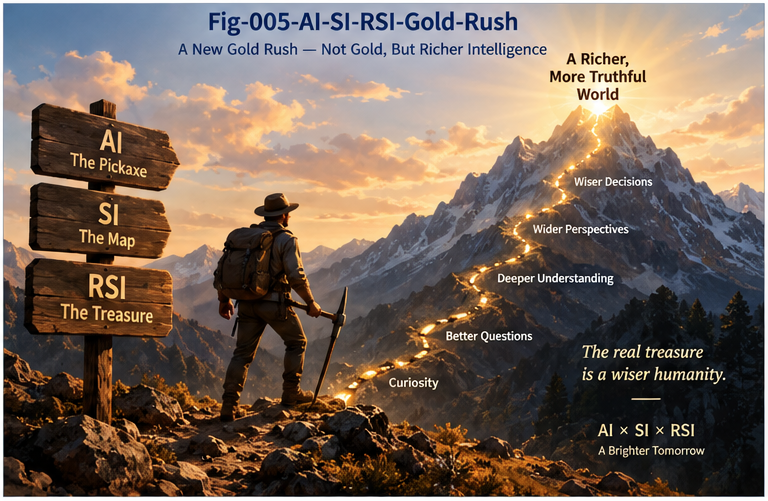

# SRSI-006 — The AI-SI-RSI Gold Rush

## Rich Evaluators, Structural Search, and Improvement Runtimes as a Possible Next Engineering Frontier

**Project:** Structural Recursive Self-Improvement (SRSI)
**Repository:** `Structural-Recursive-Self-Improvement`
**Series:** SRSI-006
**Status:** Research Outlook / Industry Thesis

---

## Abstract

Artificial intelligence has advanced through several overlapping waves of scarce technological assets.

At different stages, competitive advantage has concentrated around:

* data,
* model architectures,
* training compute,
* foundation models,
* inference infrastructure,
* tools,
* agents,
* memory,
* reasoning and search.

As AI systems become increasingly capable of generating code, hypotheses, plans, designs, strategies, and candidate improvements, another scarce asset may become increasingly important:

> **machine-operable evaluators capable of determining which generated candidates represent genuine improvement.**

This paper proposes the **AI-SI-RSI Gold Rush** as a research and engineering hypothesis.

The phrase does not predict an inevitable intelligence explosion, universal autonomous self-improvement, or a particular economic outcome.

Instead, it identifies a possible transition in AI engineering:

> **from scaling candidate generation toward scaling the infrastructure that evaluates, localizes, verifies, preserves, and governs improvement.**

Under this hypothesis, future competition may increasingly involve:

* Rich Evaluators,
* Counter-Evaluators,
* Evaluator Packs,
* Structural Search,
* Improvement Memory,
* Evaluator Routing,
* Localized RSI,
* Improvement Governance,
* Evaluator Security,
* Improvement Runtimes.

Structural Intelligence (SI) is relevant because many of these problems require explicit computational structure.

Recursive Self-Improvement (RSI) is relevant because once evaluation, search, memory, and governance are connected into a repeated improvement loop, domain-specific systems can begin to improve their own computational structures more rapidly.

This produces the possible convergence:

> **AI + SI + RSI**

The central thesis is:

> **The next major scaling frontier may not be only how many candidates AI can generate, but how rapidly machines can discover, evaluate, falsify, preserve, and safely reuse genuine improvements.**

If that transition occurs, Rich Evaluators may become one of the most valuable computational assets of the next phase of AI engineering.

---

# 1. AI Has Repeatedly Changed What Is Scarce

Technological waves often change the location of scarcity.

At one stage, data may be scarce.

Later, data becomes abundant and compute becomes scarce.

Then foundation models become valuable.

Later, access to capable models becomes widespread and orchestration becomes important.

A simplified historical progression can be represented as:

```text id="sjxyd7"
Data
  ↓
Models
  ↓
Compute
  ↓
Foundation Models
  ↓
Tools
  ↓
Agents
  ↓
Memory / Search / Reasoning
```

These layers do not replace one another.

They accumulate.

The question is:

> **What becomes scarce when candidate intelligence becomes increasingly abundant?**

One possible answer is:

# **Evaluation**

---

# 2. Candidate Abundance Changes the Engineering Problem

Modern AI systems can increasingly generate:

```text id="awh1n7"
Code

Plans

Hypotheses

Designs

Policies

Strategies

Tests

Simulations

Alternative solutions
```

As generation improves, the bottleneck can move from:

```text id="s8feyh"
Can we generate a candidate?
```

to:

```text id="du7b5n"
Which candidate is actually better?
```

And eventually:

```text id="0f52hz"
Why is it better?

Where is it better?

Where is it worse?

Under which context?

What counter-evidence exists?

Can it be trusted?

Can it be deployed locally?

Should it be promoted?
```

This is the transition from:

> **Candidate Scarcity**

to:

> **Judgment Scarcity**

---

# 3. The Evaluator Scarcity Hypothesis

We can state the hypothesis directly:

> **As AI candidate-generation capability becomes cheaper and more abundant, high-quality machine-operable evaluation may become relatively more scarce and valuable.**

This does not mean generation becomes unimportant.

It means the relative bottleneck can move.

Consider:

```text id="h3s4ol"
1 strong candidate
```

versus:

```text id="n8b8pz"
1,000,000 plausible candidates
```

The second system has more generative power.

But it also has a much harder selection problem.

Therefore:

```text id="79weqc"
More Generation
      ↓
More Candidate Space
      ↓
More Evaluation Demand
```

Scaling generation creates demand for scaling evaluation.

---

# 4. From Model Scaling to Improvement Scaling

The previous era asked:

> How do we scale models?

The emerging question may increasingly become:

> **How do we scale improvement?**

Improvement scaling requires more than model size.

A conceptual formulation is:

```text id="rfxdrg"
Improvement Capacity
       ∝
AI Capability
×
Evaluator Richness
×
Structural Search
×
Compute
×
Improvement Memory
×
Governance
```

This is not proposed as a literal mathematical law.

It is a systems perspective.

If one factor is weak, the improvement loop can bottleneck there.

---

# 5. AI + SI + RSI

The proposed frontier combines three broad capabilities.

## AI — Candidate Intelligence

AI provides:

```text id="vgv0cb"
Generation

Prediction

Reasoning

Coding

Planning

Hypothesis Formation
```

---

## SI — Structural Intelligence

Structural Intelligence provides mechanisms for:

```text id="mvws47"
Difference

Localization

Comparison

Search

Identity

Trajectory

Counter-Evidence

Memory

Policy

Dispatch
```

---

## RSI — Recursive Improvement

RSI connects them into:

```text id="bf0a6d"
Generate
   ↓
Evaluate
   ↓
Improve
   ↓
Preserve
   ↓
Generate Better
   ↓
Repeat
```

Together:

```text id="llc76v"
AI
 │
 │ Candidate Generation
 ↓
SI
 │
 │ Evaluation / Localization /
 │ Search / Memory / Governance
 ↓
RSI
 │
 │ Recursive Improvement
 ↓
Runtime Evidence
 │
 └────────────────────────→ AI + SI
```

This convergence is what this paper calls:

# **The AI-SI-RSI Gold Rush**

---



**Fig-005 — AI-SI-RSI Gold Rush.**  
As AI candidate generation becomes increasingly abundant, Rich Evaluators, Structural Search, Improvement Memory, and trusted Improvement Runtimes may emerge as a new engineering frontier.

---

# 6. Why "Gold Rush"?

The term **Gold Rush** is intentionally metaphorical.

It describes a period in which many researchers and engineering teams may independently discover that a newly valuable computational resource exists.

The "gold" is not RSI itself.

The gold may be:

```text id="a7o3da"
Reliable Evaluators

Rich Evaluation Structures

Counter-Evidence Engines

Structural Search

Domain Evaluation Knowledge

Improvement Memory

Improvement Runtimes
```

Once the value of these assets becomes clear, many teams may begin searching for them.

---

# 7. The First Rush: Evaluator Engineering

The first layer may be:

# **Evaluator Engineering**

Today, evaluation is often treated as a support activity.

In an RSI environment, it can become core infrastructure.

Teams may compete to build evaluators that are:

```text id="n8xk1s"
More accurate

More structural

More robust

More adversarial

More context-aware

More machine-operable

More auditable

Cheaper to run
```

This creates a new engineering discipline.

---

# 8. The Second Rush: Evaluator Packs

Once evaluators become reusable, they can be packaged.

For example:

# AI Coding Evaluator Pack

```text id="27jnrt"
Compiler

Unit Tests

Integration Tests

CallingGraph Delta

Runtime Trace

Performance

Security

Architecture

Counter-Evidence
```

---

# Scientific Reasoning Evaluator Pack

```text id="sjefvu"
Evidence Fit

Prediction

Replication

Counterexample Search

Mechanism

External Consistency

Uncertainty
```

---

# Manufacturing Evaluator Pack

```text id="g49u0f"
Quality

Tolerance

Throughput

Energy

Reliability

Safety

Cost

Failure Mode
```

---

# Market Evaluator Pack

```text id="3e7gxu"
Return

Risk

Drawdown

Regime

Liquidity

Transaction Cost

Crowding

Counter-Evidence
```

These packs could become reusable domain assets.

---

# 9. Evaluator Packs May Become More Valuable Than Prompts

Prompts are useful because they guide generation.

Evaluator Packs may become valuable because they guide improvement.

A prompt asks:

> Generate something useful.

An evaluator pack asks:

> **Determine whether what was generated deserves to survive.**

Under strong recursive search, the second function may become increasingly valuable.

---

# 10. The Third Rush: Structural Search

Once millions of candidates and large structural memories exist, another problem emerges:

> **Where should improvement search occur?**

Brute-force search becomes expensive.

Structural Search can identify:

```text id="91iccc"
Weak nodes

High-cost branches

Failure clusters

Uncertain regions

High-value opportunities

Relevant historical improvements
```

Then:

```text id="e47m6z"
Global Search
```

becomes:

```text id="qkhm0w"
Locate
 ↓
Search Locally
```

This may create a major market for structural search infrastructure.

---

# 11. The Fourth Rush: Improvement Runtime

Once:

```text id="6m3y30"
Generation

Evaluation

Search

Memory

Governance
```

are connected, they form:

# **Improvement Runtime**

A generic runtime is:

```text id="8f71sj"
Observe
  ↓
Detect Improvement Opportunity
  ↓
Localize
  ↓
Generate Candidates
  ↓
Evaluate
  ↓
Counter-Evaluate
  ↓
Verify
  ↓
Govern
  ↓
Deploy
  ↓
Observe
  ↓
Fold
```

At this point RSI becomes less a philosophical concept and more a software architecture.

---

# 12. RSI Before AGI

This is important.

The AI-SI-RSI Gold Rush does not require AGI.

Domain-specific recursive improvement can occur whenever a domain provides:

```text id="f5x7jg"
Candidate Generator
+
Reliable Evaluation
+
Search
+
Feedback
```

Software engineering already provides much of this.

Scientific optimization provides parts of it.

Engineering design provides parts of it.

Markets provide large amounts of feedback, although with substantial non-stationarity and evaluation difficulty.

Therefore:

> **RSI may emerge first as many narrow improvement runtimes rather than one universal self-improving intelligence.**

---

# 13. AI Coding May Be an Early Gold Field

Software has unusually rich evaluators.

A generated code candidate can face:

```text id="w9ik1q"
Compile

Tests

Static Analysis

CallingGraph

Runtime Trace

Benchmark

Security Analysis

Resource Measurement
```

This makes software one of the strongest early environments for Structural RSI.

The loop can become:

```text id="r9gupm"
AI generates code delta
        ↓
Structural localization
        ↓
Compile / Test
        ↓
CallingGraph Delta
        ↓
Counter-Evidence
        ↓
Runtime evaluation
        ↓
Promotion gate
        ↓
Deploy
        ↓
Fold result
        ↓
Next code delta
```

This is a practical form of RSI before AGI.

---

# 14. The Market Thought Experiment

Structural market intelligence provides another useful thought experiment.

Suppose a market intelligence system contains:

```text id="o9jjp7"
Historical Data

Context

Events

Patterns

Differential Trees

Strategies

Outcome Measures
```

Without recursive improvement, humans may spend years refining:

```text id="q2j0ms"
representations

patterns

metrics

strategies

dispatch policies
```

With a strong improvement runtime:

```text id="k5cq7f"
Generate Perspective
       ↓
Backtest
       ↓
Counter-Test
       ↓
Structural Compare
       ↓
Regime Evaluate
       ↓
Fold Validated Result
       ↓
Generate Again
```

the rate of structural experimentation could increase dramatically.

---

# 15. But Markets Would Not Simply Be "Solved"

It is important not to overstate the thought experiment.

Markets are:

```text id="3fszwj"
Non-Stationary

Reflexive

Competitive

Partially Observable

Cost-Constrained
```

If many participants discover similar improvements:

```text id="24pb9u"
Alpha
 ↓
Competition
 ↓
Crowding
 ↓
Market Adaptation
 ↓
Alpha Decay
```

Therefore the likely result is not:

> everyone permanently discovers the perfect strategy.

A more plausible outcome is:

> **Evaluator–Strategy–Market Co-Evolution.**

RSI changes the velocity of search.

The environment changes in response.

---

# 16. From Optimization to Co-Evolution

This pattern extends beyond markets.

Suppose:

```text id="vdlcbo"
AI improves system
```

then:

```text id="vopz7e"
environment adapts
```

then:

```text id="hm20lz"
evaluator changes
```

then:

```text id="fg8l9u"
system improves again
```

Thus advanced RSI may increasingly become:

# **Recursive Co-Evolution**

rather than optimization against a static benchmark.

---

# 17. Scientific Recursive Self-Improvement

Scientific research may provide another important field.

A scientific RSI loop could be:

```text id="nfrsks"
Hypothesis
   ↓
Experiment Design
   ↓
Evidence
   ↓
Counter-Evidence
   ↓
Structural Differential
   ↓
Replication
   ↓
Promotion / Rejection / Branch
   ↓
Knowledge Folding
   ↓
Next Hypothesis
```

This resembles the scientific method itself.

The difference is speed and machine operability.

---

# 18. The Scientific Evaluator Pack

A scientific evaluator infrastructure may contain:

```text id="u65swm"
Empirical Fit

Predictive Accuracy

Counterexample Search

Replication

Mechanistic Consistency

External Evidence

Uncertainty

Cost
```

The better this evaluator pack becomes, the more effectively AI-generated hypotheses can participate in recursive scientific improvement.

---

# 19. Evaluator Markets

If evaluators become valuable, a market may emerge around them.

Organizations may produce:

```text id="a8joxh"
Specialized Evaluators

Evaluator APIs

Evaluator Benchmarks

Evaluator Packs

Evaluator Security Tools

Evaluator Routing Systems
```

This creates a possible:

# **Evaluator Economy**

The valuable asset is not merely:

```text id="0x7ajz"
a model that generates.
```

It may also be:

```text id="h1nuhj"
a trusted computational system that knows when generated change is actually better.
```

---

# 20. Evaluator Benchmarking

As evaluator competition increases, evaluators themselves require benchmarks.

Questions include:

```text id="1x8rtz"
How often does E promote bad candidates?

How often does E reject good candidates?

How well does E detect regressions?

How robust is E against optimization?

How well does E generalize across contexts?

How expensive is E?

How auditable is E?
```

Thus:

```text id="7j3d6w"
Benchmark Models
```

may be joined by:

```text id="ihrxt7"
Benchmark Evaluators
```

---

# 21. Evaluator Security

Evaluators determine which candidates survive.

Therefore they become high-value attack surfaces.

Possible attacks include:

```text id="p5rl6w"
Evaluator gaming

Benchmark overfitting

Evidence manipulation

Counter-evidence suppression

Routing manipulation

Policy bypass

Evaluator poisoning
```

This creates another engineering field:

# **Evaluator Security**

In high-impact RSI systems, evaluator security may become as important as model security.

---

# 22. Evaluator-of-Evaluators

Once evaluators become critical infrastructure, another market appears:

```text id="4yxgmy"
Who evaluates the evaluators?
```

This creates:

# **Meta-Evaluation**

Systems may measure:

```text id="n9o3uq"
Evaluator calibration

Historical accuracy

Adversarial robustness

Coverage

Runtime prediction quality
```

Evaluator-of-Evaluators may become a major infrastructure layer.

---

# 23. Evaluator Reputation

Over time, evaluators can accumulate performance histories.

For example:

```text id="9j35ls"
Evaluator E7

Coding:
excellent

Security:
moderate

Long-Horizon:
poor

Adversarial Robustness:
high
```

This creates:

> **Context-Bound Evaluator Reputation**

Evaluator selection can then become evidence-based.

---

# 24. Evaluator Routing as an Industry Layer

Different candidates require different evaluators.

Therefore another layer is:

# **Evaluator Routing**

```text id="7n4fmr"
Candidate
   ↓
Type / Context / Risk
   ↓
Evaluator Router
   ├── E1
   ├── E2
   ├── E3
   └── E4
```

This resembles dispatch in other computational systems.

The routing itself may become an optimization problem.

---

# 25. Evaluator Composition

Some candidates require evaluator chains:

```text id="kud4we"
Fast Evaluator
   ↓
Structural Evaluator
   ↓
Counter-Evaluator
   ↓
Deep Verification
   ↓
Policy Evaluator
```

Others may use parallel evaluation.

Thus evaluator composition becomes another engineering discipline.

---

# 26. The Evaluator Supply Chain

A mature RSI ecosystem may eventually contain:

```text id="apylgg"
Evaluator Producer
       ↓
Evaluator Benchmark
       ↓
Evaluator Certification
       ↓
Evaluator Pack
       ↓
Evaluator Router
       ↓
Improvement Runtime
       ↓
Runtime Evidence
       ↓
Evaluator Update
```

This resembles a computational supply chain.

Its central commodity is trustworthy judgment.

---

# 27. Structural Memory as Capital

Improvement history also becomes valuable.

Suppose an organization has accumulated:

```text id="nxkdo9"
1,000,000 validated improvement attempts
```

including:

```text id="6q0a4i"
successes

failures

counterexamples

contexts

rollback events

evaluator errors
```

That history can become:

# **Structural Improvement Capital**

A new candidate does not begin from zero.

It searches accumulated structural experience.

---

# 28. Negative Experience May Be Especially Valuable

Failed improvements can become valuable assets.

They reveal:

```text id="snzmku"
what looked promising but failed

which evaluator was fooled

which context caused regression

which policy prevented damage
```

Therefore:

> **A mature improvement system may become valuable partly because of the mistakes it has learned not to repeat.**

This is difficult to obtain merely by scaling generation.

---

# 29. Structural Memory Creates Compounding Returns

Without memory:

```text id="x82gj8"
Cycle 1
Cycle 2
Cycle 3
```

are mostly independent.

With memory:

```text id="t6vweu"
Cycle 1
   ↓
Fold
   ↓
Cycle 2
   ↓
Fold
   ↓
Cycle 3
```

Each cycle inherits validated structure.

This creates:

> **Cumulative Improvement**

which is one of the defining properties required for meaningful RSI.

---

# 30. The Structural Search Rush

As improvement memory grows, retrieval becomes critical.

A million stored improvements are useless if the system cannot locate the relevant one.

Thus:

```text id="tyt7cn"
Structural Memory
       +
Structural Search
```

becomes a powerful combination.

The system can ask:

```text id="7s2vsa"
Have we seen this failure before?

Which branch solved it?

Which counter-evidence existed?

Which evaluator was reliable?

Which policy applied?
```

This is a different kind of scaling.

It scales reusable experience.

---

# 31. Improvement Infrastructure May Become a Competitive Moat

If candidate generation becomes widely available through strong general models, differentiation may shift toward:

```text id="63ue4e"
Domain Evaluators

Structural Memory

Runtime Evidence

Counter-Evidence Libraries

Improvement Policies

Evaluator Reputation
```

These assets are difficult to reproduce quickly.

They accumulate through repeated operation.

Therefore they may become significant competitive advantages.

---

# 32. Open Evaluators Can Reduce Monopoly Pressure

There is also an important open-source dimension.

If evaluator infrastructure remains proprietary, organizations with the strongest evaluators may gain disproportionate control over recursive improvement.

Open evaluator research can reduce this concentration.

Open structures can allow:

```text id="47bx74"
independent replication

cross-lab evaluation

community counter-evidence

alternative evaluator packs

shared improvement protocols
```

This is one reason public structural research may matter.

---

# 33. Evaluator Pluralism

Open evaluator ecosystems also support:

# **Evaluator Pluralism**

Instead of one organization defining:

```text id="axl3eo"
what counts as improvement,
```

different evaluators can represent:

```text id="2bh8rn"
different objectives

different contexts

different policies

different risk tolerances

different technical perspectives
```

This can make improvement claims more contestable.

---

# 34. The Risk of Evaluator Monopoly

A dominant evaluator can become:

```text id="21xjmq"
a de facto definition of improvement.
```

If that evaluator contains blind spots, the entire ecosystem may optimize around them.

Therefore evaluator diversity is not only technically useful.

It may also be institutionally important.

---

# 35. The Gold Rush Is Not Necessarily Centralized

A common RSI image is:

```text id="h5we6v"
one giant AI
self-improves
faster and faster
```

But the AI-SI-RSI Gold Rush may look different.

It may consist of:

```text id="z7fpxh"
Thousands of domain-specific improvement loops

Millions of specialized evaluators

Large shared evaluator ecosystems

Local recursive optimization

Open structural memories

Competing improvement runtimes
```

This would be a distributed RSI landscape.

---

# 36. Localized RSI May Dominate Early

Whole-system autonomous RSI is extremely difficult.

Localized RSI is easier.

For example:

```text id="c7ktyy"
Improve one compiler optimization.

Improve one database planner.

Improve one scientific model.

Improve one CallingGraph branch.

Improve one evaluator.

Improve one market pattern classifier.
```

Each can participate in recursive improvement.

Therefore the first large RSI wave may be:

> **millions of small recursive improvement loops rather than one giant recursive intelligence loop.**

---

# 37. The MET Perspective

From a Minimum Engineering Test perspective, the important question is not:

> Can we build the final RSI system today?

It is:

> **What is the smallest runnable structure that demonstrates one useful recursive improvement loop?**

For example:

```text id="gr1c1h"
Generate 10 candidates
       ↓
Evaluate structurally
       ↓
Search counter-evidence
       ↓
Promote one local improvement
       ↓
Observe
       ↓
Fold result
       ↓
Use folded result in next cycle
```

If this loop works, the principle becomes experimentally accessible.

---

# 38. The Gold Rush May Begin with METs

Large technological waves often begin with small working systems.

The early SRSI equivalent may be:

```text id="5zwrrd"
small evaluator

small search space

small local improvement

clear runtime feedback
```

Then:

```text id="h12xcz"
repeat

scale

compose
```

This is a more grounded path than waiting for a universal RSI architecture.

---

# 39. AI Coding as a Canonical MET

AI coding may be one of the best early MET domains because evaluation is unusually machine-operable.

A canonical experiment could be:

```text id="sw5exx"
Baseline Program
      ↓
AI Generates Delta
      ↓
Compiler
      ↓
Tests
      ↓
CallingGraph Delta
      ↓
Counter-Evidence
      ↓
Performance
      ↓
Promotion Policy
      ↓
Deploy
      ↓
Observe
      ↓
Fold
```

Then repeat.

This provides a measurable Structural RSI loop.

---

# 40. Evaluator Improvement as Another MET

Another experiment is:

```text id="3d4wkj"
Evaluator E1
      ↓
Observe prediction failures
      ↓
Generate E2
      ↓
Compare E1 vs. E2
      ↓
Counter-Evaluate
      ↓
Shadow deploy E2
      ↓
Measure
      ↓
Promote / Reject
```

Here the object being recursively improved is the evaluator itself.

This directly tests recursive evaluator growth.

---

# 41. The Three Gold Rush Layers

The emerging landscape can be summarized in three major layers.

## Layer 1 — Evaluator Rush

Find better ways to determine:

```text id="8v6h7e"
B > A?
```

with rich evidence.

---

## Layer 2 — Structural Search Rush

Find better ways to determine:

```text id="nlg87p"
Where should we search for B?
```

and:

```text id="c18wdg"
Which previous improvement is relevant?
```

---

## Layer 3 — Improvement Runtime Rush

Build:

```text id="dh8dqq"
Generate
→ Evaluate
→ Counter-Evaluate
→ Localize
→ Verify
→ Govern
→ Deploy
→ Observe
→ Fold
→ Repeat
```

Together these constitute the proposed AI-SI-RSI frontier.

---

# 42. A Possible Fourth Layer: Improvement Networks

Once multiple improvement runtimes exist, they may share experience.

For example:

```text id="9yk7a5"
Runtime A
   ↓
Validated Improvement
   ↓
Shared Structural Representation
   ↓
Runtime B
```

This creates:

# **Improvement Networks**

The unit of exchange is not merely data.

It may be:

```text id="i5o3pt"
validated structural experience.
```

---

# 43. Collective Recursive Improvement

Improvement networks could create:

# **Collective Recursive Improvement**

Instead of:

```text id="axp28j"
one AI improves itself,
```

we may see:

```text id="e32y5j"
many AI systems

many evaluators

many humans

many runtimes

sharing validated improvement structures.
```

This is a very different picture of RSI.

---

# 44. Collective Learning Changes the RSI Narrative

The conventional RSI narrative is highly individual:

```text id="xqijmh"
AI improves AI.
```

A structural collective-learning narrative is:

```text id="0ek1gi"
AI proposes

Evaluators challenge

Humans govern

Runtime verifies

Structure preserves

Other systems reuse
```

Recursive improvement becomes an ecosystem process.

---

# 45. This Could Reduce the Importance of One "Super-System"

If improvement is distributed across:

```text id="ejufsk"
specialized evaluators

domain memories

local runtimes

shared structures
```

then progress may not depend entirely on one monolithic system.

This could produce a more modular technological landscape.

It is a possibility worth studying.

---

# 46. But the Gold Rush Also Creates Risks

A rapid evaluator/improvement-runtime wave would introduce new risks.

These include:

```text id="vjhkuy"
Bad evaluators at scale

Recursive benchmark gaming

Evaluator poisoning

Unsafe improvement promotion

Uncontrolled local optimization

Improvement-runtime compromise

Evaluator monoculture

Hidden structural regressions
```

Therefore the Gold Rush itself requires governance.

---

# 47. Faster Improvement Magnifies Both Quality and Error

Recursive improvement is a multiplier.

If the evaluation structure is good:

```text id="j60eei"
Good Improvement
      ↓
Better System
      ↓
Better Improvement
```

If the evaluation structure is bad:

```text id="l3a3v6"
False Improvement
      ↓
Misaligned System
      ↓
More Effective False Improvement
```

Thus:

> **RSI amplifies the quality of its improvement infrastructure—for better or worse.**

---

# 48. Improvement Governance Becomes an Industry Requirement

As improvement velocity rises, manual approval of every small change becomes impossible.

But fully automatic promotion may be unsafe.

This creates demand for:

# **Improvement Governance Infrastructure**

including:

```text id="o9mkvl"
Risk tiers

Promotion policies

Local deployment

Shadow testing

Rollback

Audit

Improvement provenance

Human escalation
```

Governance therefore becomes part of the Gold Rush, not an external afterthought.

---

# 49. From Action Governance to Improvement Governance

Traditional AI governance often focuses on:

```text id="i3u18j"
What may AI do?
```

RSI adds:

```text id="z1m98m"
What may AI change about itself or its improvement machinery?
```

This distinction becomes critical.

A future system may be authorized to perform an action but not authorized to modify the evaluator that governs future actions.

Therefore:

```text id="k1lhgx"
Action Authority
        ≠
Improvement Authority
```

This creates a new governance layer.

---

# 50. Improvement Authority May Become a First-Class Permission

Future systems may explicitly represent:

```text id="8g76gq"
READ

ACT

GENERATE-CANDIDATE

EVALUATE

PROMOTE-LOCAL

PROMOTE-GLOBAL

MODIFY-EVALUATOR

MODIFY-GOVERNANCE
```

This would turn recursive improvement authority into an explicit computational permission system.

---

# 51. The Gold Rush and the Doom/No-Doom Debate

The AI-SI-RSI Gold Rush provides another way to move beyond the doom/no-doom binary.

Instead of asking only:

```text id="27iwc4"
Will RSI destroy us?
```

or:

```text id="j4j31y"
Will RSI create abundance?
```

we can ask:

```text id="b6t1v0"
Which evaluators exist?

How rich are they?

How are they attacked?

How are improvements localized?

How are regressions detected?

Who controls promotion?

How reversible are deployments?

How is experience preserved?
```

These questions are actionable.

---

# 52. Engineering Structure Before Final Prediction

We do not need certainty about the ultimate trajectory of RSI to improve its engineering foundations.

We can work now on:

```text id="ssj8g1"
Better Evaluators

Better Counter-Evidence

Better Localization

Better Search

Better Memory

Better Governance
```

This is valuable under both optimistic and pessimistic futures.

Therefore:

> **Engineering the structure of improvement is useful even when the final consequences of RSI remain uncertain.**

---

# 53. A New Scaling Thesis

The traditional scaling thesis emphasizes:

```text id="5bd9fk"
More Data

More Parameters

More Compute
```

A Structural RSI scaling thesis adds:

```text id="8h91uo"
More Evaluator Richness

More Structural Search

More Counter-Evidence

More Improvement Memory

More Governed Iteration
```

This does not replace compute scaling.

It extends it.

---

# 54. Compute Multiplied by Structure

Compute can search enormous spaces.

Structure determines:

```text id="c1a30x"
where to search

what to compare

what to preserve

what to reject

what to challenge

what to deploy
```

Thus:

> **Compute without structure can search harder. Structure can help search matter.**

The combination is more important than either alone.

---

# 55. A Possible New Scarcity Hierarchy

If AI continues advancing, a future hierarchy may look like:

```text id="l4b5t2"
Generation
    ↓
abundant

Basic Models
    ↓
widely available

Compute
    ↓
expensive but scalable

Reliable Domain Evaluators
    ↓
scarce

Validated Structural Memory
    ↓
scarcer

Trusted Improvement Runtime
    ↓
extremely valuable
```

This is a hypothesis.

But it suggests where engineering attention may move.

---

# 56. Evaluators as Intellectual Infrastructure

Evaluators encode something deeper than performance metrics.

They encode:

```text id="wxtqtn"
what a domain considers success

what it considers failure

which trade-offs matter

which contexts matter

which risks matter

which evidence matters
```

Therefore evaluator engineering is partly:

> **the computational encoding of domain judgment.**

That makes high-quality evaluators difficult and valuable.

---

# 57. Domain Expertise Becomes Machine-Operable

A mature Evaluator Pack can convert human expertise into:

```text id="iwc5qg"
machine-operable judgment.
```

For example, a senior software engineer knows to ask:

```text id="u31lkg"
Does it compile?

Do tests pass?

What changed structurally?

What dependencies moved?

What is the blast radius?

Can we roll back?
```

Encoding this into an evaluator runtime allows AI to use that expertise recursively.

This may be one of the most important ways domain expertise enters RSI.

---

# 58. The Gold Rush May Be a Knowledge-Engineering Renaissance

The rise of foundation models shifted attention away from manually structured knowledge.

SRSI may partially reverse that trend.

If evaluator quality becomes critical, then:

```text id="c7i54e"
domain structures

metrics

graphs

rules

tests

counterexamples

policies
```

become valuable again.

This may create a:

> **Knowledge-Engineering Renaissance**

inside AI.

Not as a replacement for neural models.

As their improvement infrastructure.

---

# 59. Structural Intelligence May Become More Valuable Under RSI

During ordinary inference, a system may need only:

```text id="h6x3ke"
Input
 ↓
Good Answer
```

RSI requires much more:

```text id="05v20d"
Why is B better than A?

Where?

Under what context?

What regressed?

What changed structurally?

Can the change be localized?

Can it be reversed?

Should it be promoted?

What should be remembered?
```

These are structural questions.

Therefore:

> **RSI may expose the hidden value of Structural Intelligence.**

---

# 60. From Intelligence Structure to Improvement Structure

Structural Intelligence originally asks:

```text id="n7ny56"
How should intelligence itself be structured?
```

SRSI adds:

```text id="bft4xc"
How should improvement itself be structured?
```

This is an important shift.

The second question may become as important as the first.

---

# 61. A New Research Landscape

The AI-SI-RSI frontier creates many research directions:

```text id="7cv6gg"
Rich Evaluator Theory

Evaluator Metrics

Evaluator Diversity

Counter-Evidence Search

Evaluator Security

Evaluator Routing

Evaluator Packs

Evaluator Markets

Structural Search

Improvement Memory

Localized RSI

Improvement Governance

Improvement Provenance

Evaluator-of-Evaluators

Collective Recursive Improvement
```

This is a large research landscape.

---

# 62. A Practical Research Strategy

Rather than attempting to solve all of RSI at once, a practical strategy is:

```text id="ynb2n0"
Choose one domain
      ↓
Build one rich evaluator
      ↓
Add counter-evidence
      ↓
Add structural localization
      ↓
Add candidate generation
      ↓
Add promotion policy
      ↓
Add memory
      ↓
Close the loop
```

This produces a Minimum Engineering Test.

Then scale.

---

# 63. The First Question for Every Domain

A useful SRSI research question is:

> **What would a Rich Evaluator look like in this domain?**

For software:

```text id="sqb33e"
tests + graph + runtime + security
```

For science:

```text id="vjijcy"
evidence + falsification + replication
```

For markets:

```text id="6zzv3n"
return + risk + regime + counter-evidence
```

For manufacturing:

```text id="snnxks"
quality + reliability + cost + safety
```

This question can immediately reveal whether a domain is ready for recursive improvement.

---

# 64. The Second Question

Then ask:

> **Can the improvement be localized?**

If yes:

```text id="sod5i1"
whole-system RSI
```

can become:

```text id="hjdwj9"
local structural RSI.
```

This usually reduces engineering difficulty.

---

# 65. The Third Question

Then ask:

> **Can validated improvement be preserved as reusable structure?**

If yes, repeated optimization becomes cumulative.

This is where:

```text id="qve4h5"
Folding

Structural Memory

Improvement History
```

become critical.

---

# 66. The Fourth Question

Finally:

> **Who or what is authorized to promote the improvement?**

Without this question, evaluation and action collapse together.

With it:

```text id="gys3f8"
Candidate
   ↓
Evaluation
   ↓
Validation
   ↓
Governance
   ↓
Deployment
```

becomes explicit.

---

# 67. The AI-SI-RSI Grand Formula

The overall thesis can be summarized as:

```text id="m5f8ne"
AI Capability
      ×
Rich Evaluators
      ×
Structural Search
      ×
Compute
      ×
Structural Memory
      ×
Improvement Governance
      ↓
Structural Recursive Self-Improvement
```

Again, this is conceptual rather than mathematical.

Its purpose is to show that recursive improvement is multiplicative across several infrastructure layers.

---

# 68. What the Gold Rush Does Not Claim

The AI-SI-RSI Gold Rush thesis does **not** claim:

```text id="zod2da"
AGI is imminent.

Intelligence explosion is inevitable.

RSI will solve every domain.

Markets will become perfectly predictable.

Evaluators can eliminate all risk.

DBM-SI is the only path to RSI.
```

Those claims are unnecessary.

The narrower claim is enough:

> **As AI generation and search become stronger, machine-operable improvement evaluation and structural improvement infrastructure are likely to become increasingly important engineering problems.**

That proposition can be tested.

---

# 69. What Can Be Tested Now

We can already test:

```text id="4v5bbq"
Does richer evaluation improve candidate selection?

Does counter-evidence reduce false promotion?

Does localization reduce evaluation cost?

Does structural memory accelerate later search?

Does evaluator diversity improve robustness?

Does staged promotion reduce regression?

Can evaluator performance itself be recursively improved?
```

These are empirical research questions.

No speculative superintelligence is required.

---

# 70. The Gold Rush Is an Invitation

The purpose of this thesis is not to declare ownership of a new field.

It is the opposite.

The AI-SI-RSI frontier will require:

```text id="ipgr62"
different evaluator architectures

different structural representations

different domains

different research traditions

different governance approaches
```

The more independent approaches exist, the more seriously the hypothesis can be tested.

Therefore:

> **SRSI should be treated as an open research direction rather than a closed architecture.**

---

# 71. DBM-SI's Role

DBM-SI contributes one family of structures:

```text id="u4b92y"
MDT

CCC

Two-Way CCC

Counter-Evidence

UTN

CallingGraph

Trajectory Intelligence

Per-Node Intelligence

Structural Folding

PDS
```

These structures can participate in SRSI.

But they are examples, not boundaries.

Other frameworks should contribute their own evaluator and improvement structures.

---

# 72. Open Research Can Accelerate Evaluator Diversity

Publishing evaluator structures openly can allow:

```text id="jewmnn"
independent implementation

criticism

counterexamples

benchmarking

alternative designs

cross-domain reuse
```

This may be especially valuable because evaluator monoculture itself can create systemic risk.

Open research increases the number of perspectives available to challenge improvement claims.

---

# 73. The Strategic Opportunity

If the Evaluator Scarcity Hypothesis is correct, an important strategic shift follows.

The question for AI organizations becomes not only:

> How strong is our model?

but:

> **How strong is our improvement infrastructure?**

That includes:

```text id="9z0xho"
What can we evaluate?

How richly?

How quickly?

How adversarially?

How locally?

How cumulatively?

How safely?
```

These may become core competitive dimensions.

---

# 74. From AI Products to Improving AI Systems

Today's AI products often perform tasks.

Tomorrow's systems may increasingly improve the structures used to perform those tasks.

The transition is:

```text id="9grnhc"
AI performs work
       ↓
AI proposes better ways to perform work
       ↓
AI evaluates those proposals
       ↓
AI preserves validated improvements
       ↓
AI uses them in future work
```

This is a practical path toward recursive improvement.

---

# 75. From One-Time Optimization to Continuous Improvement

Traditional development often looks like:

```text id="5z4a1e"
Build
 ↓
Release
 ↓
Maintain
```

SRSI suggests:

```text id="8ev86q"
Build
 ↓
Observe
 ↓
Improve
 ↓
Evaluate
 ↓
Deploy
 ↓
Observe
 ↓
Improve
 ↓
...
```

Improvement becomes continuous infrastructure.

---

# 76. The Possible New Unit of AI Progress

The dominant unit of progress has often been:

```text id="7urxb8"
New Model
```

A future unit may increasingly be:

```text id="5bd8sc"
Validated Improvement Loop
```

A system capable of reliably producing thousands of small validated improvements may outperform one that depends on occasional monolithic upgrades.

This is one of the deepest implications of Localized SRSI.

---

# 77. The Gold Rush and Scale

The AI-SI-RSI thesis does not reject the scaling hypothesis.

It extends it.

Large compute may become even more valuable when connected to:

```text id="7d7n6q"
Rich Evaluators

Structural Search

Improvement Memory
```

because compute can then explore improvement spaces more intelligently.

Thus the future may not be:

```text id="hxulpf"
Scale vs. Structure
```

but:

```text id="g1h3r7"
Scale × Structure
```

---

# 78. Scaling Search Quality

The goal is not merely:

```text id="m3qv9f"
more search.
```

It is:

```text id="pl2v9f"
more useful search

more falsifiable search

more localized search

more cumulative search
```

This is improvement scaling rather than candidate scaling alone.

---

# 79. A Possible New MET Wave

If these ideas prove useful, a new Minimum Engineering Test wave may emerge.

Researchers could build small demonstrations of:

```text id="dpvthh"
Evaluator Packs

Counter-Evidence Engines

Local RSI Loops

Evaluator-of-Evaluators

Improvement Governance

Structural Memory
```

Each MET tests one part of the larger SRSI thesis.

This is a practical way to explore the Gold Rush without overclaiming.

---

# 80. Central Thesis

The argument of this paper can be summarized in eight propositions.

### Proposition 1

> **As candidate generation becomes abundant, trustworthy evaluation may become relatively scarce.**

### Proposition 2

> **Rich machine-operable evaluators may therefore become major AI infrastructure assets.**

### Proposition 3

> **Evaluator Packs, Evaluator Routing, Evaluator Security, and Evaluator Benchmarking may emerge as distinct engineering layers.**

### Proposition 4

> **Structural Search and Structural Memory can turn repeated candidate generation into cumulative improvement.**

### Proposition 5

> **Domain-specific Localized RSI may emerge well before universal whole-system RSI.**

### Proposition 6

> **Improvement Governance becomes increasingly important as improvement velocity increases.**

### Proposition 7

> **The combination of AI generation, Structural Intelligence, and recursive improvement may create a broad new engineering frontier.**

### Proposition 8

> **This frontier should be explored experimentally rather than assumed to imply either inevitable doom or inevitable abundance.**

---

# 81. Conclusion

Artificial intelligence is becoming increasingly good at producing possibilities.

That success creates the next problem:

> **Which possibilities deserve to become reality?**

Recursive Self-Improvement magnifies this problem because every accepted candidate can influence the machinery that generates the next generation of candidates.

The engineering frontier therefore expands from:

```text id="n0y8mb"
Generation
```

to:

```text id="vntctd"
Generation
+
Evaluation
+
Counter-Evidence
+
Localization
+
Search
+
Verification
+
Memory
+
Governance
```

This is the foundation of Structural Recursive Self-Improvement.

If AI continues to make candidate generation increasingly abundant, then Rich Evaluators, Structural Search, Improvement Memory, and Improvement Runtimes may become some of the most valuable new computational assets.

That possibility motivates the term:

# **AI-SI-RSI Gold Rush**

The Gold Rush is not a prediction that intelligence will suddenly become infinite.

It is a prediction of a research question:

> **What happens when powerful AI generation meets machine-operable structural evaluation and recursive improvement loops?**

We can begin answering that question now.

Not through speculation alone.

Through:

```text id="5cknsv"
small evaluators

small structural searches

small improvement loops

small governance systems

small METs
```

and then:

```text id="f8j2t5"
measure

challenge

fold

scale
```

The next major AI frontier may therefore be not only building systems that are more capable.

It may be building systems that are better at determining:

> **what should improve,**

> **what actually improved,**

> **why it improved,**

> **where it should be used,**

> **what evidence could prove it wrong,**

> **and whether it deserves to become part of the next system.**

That is the engineering territory of Structural Recursive Self-Improvement.

And if that territory proves as rich as it currently appears, the rush to explore it may only be beginning.

---

## SRSI Principle

> **The next scarce AI resource may be trustworthy machine-operable judgment.**

And:

> **The next scaling frontier may not be only generating more candidates, but recursively discovering, falsifying, preserving, and governing better improvements.**

---

## Final SRSI v1.0 Progression

```text id="j0n6t5"
SRSI-001
From RSI to Structural RSI
        ↓
SRSI-002
Rich Evaluators
        ↓
SRSI-003
DBM-SI as Improvement Infrastructure
        ↓
SRSI-004
Two-Way CCC + Counter-Evidence
        ↓
SRSI-005
Localized RSI + Structural Growth
        ↓
SRSI-006
AI-SI-RSI Gold Rush
```

Together:

```text id="l8t68n"
AI Candidate Generation
          ↓
Rich Evaluators
          ↓
Evidence ↔ Counter-Evidence
          ↓
Structural Search
          ↓
Localization
          ↓
Validated Improvement
          ↓
Improvement Governance
          ↓
Selective Deployment
          ↓
Runtime Evidence
          ↓
Structural Folding
          ↓
Recursive Structural Growth
          ↺
```

---

## Project Navigation

This document is the sixth core paper in the **Structural Recursive Self-Improvement (SRSI)** v1.0 series.

### Core Papers

1. **SRSI-001 — From Recursive Self-Improvement to Structural RSI**
2. **SRSI-002 — Rich Evaluators: The Missing Infrastructure of RSI**
3. **SRSI-003 — DBM-SI as a Rich Evaluator and Improvement Infrastructure**
4. **SRSI-004 — Two-Way CCC, Counter-Evidence, and Anti-Goodhart RSI**
5. **SRSI-005 — Localized RSI, Structural Growth, and Improvement Governance**
6. **SRSI-006 — The AI-SI-RSI Gold Rush**

### Core Research Question

> **What computational structures make recursive improvement evaluable, falsifiable, localizable, auditable, cumulative, reversible, and governable?**

### Core Thesis

> **Recursive self-improvement is not merely recursive generation under increasing compute. It is recursive generation under rich evaluation, counter-evidence, structural localization, cumulative memory, verification, and governed promotion.**
